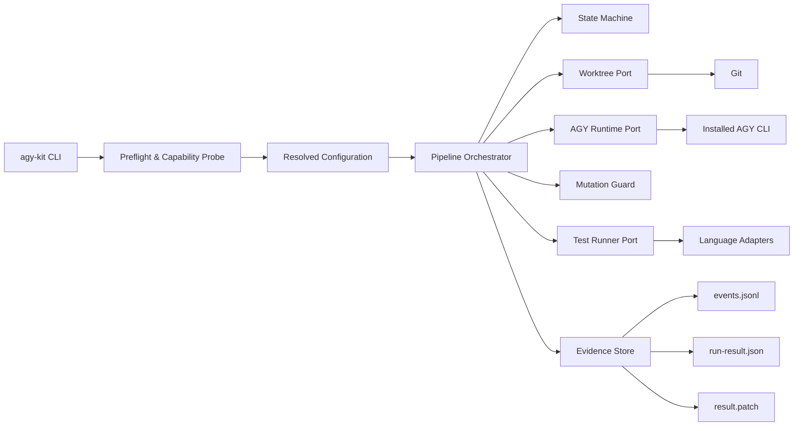

# Đề xuất cải tiến kiến trúc và release-hardening cho agy-kit

> Trạng thái: Proposed for implementation  
> Baseline đánh giá: `minhgv/agy-kit@662c22aae81a7600ef71da535b963648365346ea`  
> Mục tiêu: đưa agy-kit từ technical alpha lên production-ready, đạt 10/10 theo từng hạng mục của PRD  
> Đối tượng đọc: Principal Engineer, Solution Architect, Tech Lead, Security Engineer, QA Lead, DevOps/SRE  
> Ngôn ngữ quy phạm: **MUST**, **MUST NOT**, **SHOULD**, **MAY** được hiểu theo RFC 2119

---

## 1. Tóm tắt điều hành

agy-kit đã có hướng thiết kế đúng hơn so với phiên bản ban đầu: custom agent được mô tả bằng Markdown/YAML, có schema, fake AGY, worktree runner và một số test phá hoại. Tuy nhiên, các thành phần này đang tồn tại như những nhánh triển khai rời rạc. Đường chạy sản phẩm chính vẫn gọi `agy -p` trực tiếp trong primary worktree, không sử dụng orchestrator, state machine, structured contract hay worktree manager.

Vấn đề cốt lõi không phải là thiếu thêm tài liệu hoặc thiếu thêm workflow. Vấn đề là chưa có **một execution path duy nhất, an toàn, có hợp đồng và có thể kiểm chứng**.

Đề xuất này lựa chọn chiến lược sau:

1. Xây một control plane Python duy nhất cho mọi pipeline run.
2. Tách rõ orchestration khỏi AGY runtime, Git worktree, test runner và evidence storage.
3. Mặc định chạy trong isolated worktree; không có đường tắt chạy mutation stage trong primary worktree.
4. Mọi stage trao đổi bằng versioned JSON contract, không suy luận thành công từ text tự do.
5. AGY capability phải được khám phá ở runtime; thiếu capability thì fail closed.
6. Toàn bộ điểm chất lượng phải được tính từ evidence của run hiện tại; không dùng số liệu hardcode hoặc report cũ.
7. CI chạy cùng entrypoint và cùng policy với người dùng, không có “CI path” riêng yếu hơn production path.

### 1.1 Quyết định kiến trúc

Chọn mô hình **modular monolith control plane** bằng Python cho phiên bản 1.x. Không chuyển sang microservices và không tạo plugin framework tổng quát ở giai đoạn này.

Lý do:

- Quy mô hiện tại chưa cần distributed orchestration.
- Các transaction quan trọng đều gắn với một local repository và một Git worktree.
- Một process giúp cleanup, signal handling và evidence consistency dễ kiểm chứng hơn.
- Boundary giữa các module vẫn được định nghĩa bằng typed ports, cho phép tách riêng trong tương lai mà không phải thiết kế quá mức ngay bây giờ.

### 1.2 Kết quả mong đợi

Sau khi triển khai:

- `agy-kit run <feature>` là entrypoint chuẩn duy nhất.
- Mỗi run có `run_id`, manifest, worktree riêng, log JSONL, stage result và artifact checksums.
- Planner, coder, reviewer và QA được resolve và kiểm chứng là agent có thể discover.
- Mọi file mutation nằm trong manifest và trong isolated worktree.
- Apply về primary repository luôn là thao tác riêng, explicit và có precondition.
- Unit, contract, integration, destructive và live-smoke test đều là required gates tương ứng.
- Không còn tuyên bố “production-ready” hoặc “100/100” nếu thiếu live evidence.

---

## 2. Hiện trạng và phân tích nguyên nhân gốc

### 2.1 Điểm chất lượng baseline

| Hạng mục | Điểm baseline | Vấn đề chặn |
|---|---:|---|
| Architecture & product design | 5/10 | State machine lỗi và không được sử dụng bởi pipeline chính |
| AGY compatibility | 4/10 | Chưa có live discovery; tài liệu còn cú pháp không hỗ trợ |
| Testing & evaluation | 3/10 | Unit/destructive/eval đang fail; metric hardcode |
| Safety & security | 0/10 | Pipeline chính có thể sửa primary worktree |
| CI & release engineering | 3/10 | CI thiếu required gates và command eval hiện fail |
| Documentation & DX | 4/10 | Tài liệu mâu thuẫn với behavior và evidence |
| Maintainability & observability | 3/10 | Nhiều source of truth, typed contract chưa hoàn chỉnh |

Điểm tổng hợp theo trọng số: khoảng **2,9/10**. Mức trưởng thành: **technical alpha**.

### 2.2 Nhóm vấn đề P0

### P0-A — Execution path bị phân mảnh

Hiện có ít nhất ba cách biểu diễn pipeline:

- target trong `Makefile`;
- `bin/agy-pipeline.sh`;
- các lớp trong `src/agy_kit`.

Chúng không dùng chung một orchestrator và không có một nguồn policy duy nhất. Vì vậy, việc thêm safety vào `safe-agent-run.sh` không làm cho `make pipeline` trở nên an toàn.

**Nguyên nhân gốc:** kiến trúc được bổ sung theo chiều ngang bằng file mới, nhưng chưa thay thế đường chạy cũ.

### P0-B — Safety là opt-in thay vì invariant

Worktree isolation tồn tại, nhưng pipeline mặc định vẫn chạy trong primary repository. Một script khác còn mặc định `--dangerously-skip-permissions`.

**Nguyên nhân gốc:** permission mode, worktree policy và apply policy chưa được gom thành một domain policy bắt buộc.

### P0-C — State machine chỉ là dữ liệu trang trí

`PipelineOrchestrator.transition_to()` hiện chấp nhận mọi trạng thái, không kiểm tra transition hợp lệ. `to_dict()` lỗi runtime do thiếu `self`. CLI Python chỉ in help/version và không điều khiển pipeline.

**Nguyên nhân gốc:** chưa áp dụng test-first trên public behavior và chưa có contract giữa CLI với orchestration core.

### P0-D — Compatibility được giả định thay vì quan sát

Agent files đã gần đúng định dạng native, nhưng pipeline chưa chứng minh agent được AGY discover và thực thi. Documentation vẫn còn nhiều ví dụ `agy run --agent ...`.

**Nguyên nhân gốc:** không có capability probe và live compatibility suite làm release gate.

### P0-E — Test có nhưng chưa tạo niềm tin

Một số test chỉ kiểm tra file tồn tại, test concurrency không chứng minh race protection, test illegal transition không thực hiện illegal transition. Test sync có thể tự sửa source. Evaluator dùng token/cost hardcode và committed report.

**Nguyên nhân gốc:** test đang xác nhận cấu trúc hoặc keyword thay vì observable behavior; test và implementation dùng chung giả định.

### P0-F — CI không đại diện cho release quality

CI chưa chạy unit tests mới, destructive tests, fake-AGY integration, ShellCheck, actionlint, coverage và fixture matrix. Một số dependency không có manifest/lockfile chuẩn.

**Nguyên nhân gốc:** chưa có một lệnh verification canonical được dùng đồng nhất ở local và CI.

### P0-G — Documentation tự chứng nhận

Repository vẫn có tuyên bố A+, Enterprise Production Grade, 100/100 và chi phí cố định dù test hiện tại không đạt.

**Nguyên nhân gốc:** documentation không được sinh hoặc kiểm chứng từ release evidence hiện tại.

---

## 3. Nguyên tắc thiết kế bắt buộc

1. **One entrypoint:** mọi pipeline run MUST đi qua `agy-kit run`.
2. **Fail closed:** thiếu capability, scanner, schema hoặc evidence bắt buộc MUST làm run thất bại.
3. **Primary worktree immutable by default:** mutation stage MUST chạy trong isolated worktree.
4. **Explicit apply:** đưa thay đổi về primary MUST là lệnh riêng, có xác nhận và precondition.
5. **Structured contracts:** success/failure MUST được xác định từ schema-valid result, không từ chuỗi “completed”.
6. **No shell interpolation:** external command MUST được gọi bằng argument array; không dùng `shell=True`.
7. **Evidence is per-run:** report MUST được sinh trong output directory không commit, có timestamp và checksum.
8. **Observed, not assumed:** capability, version, token và cost MUST là observed hoặc `not_collected`.
9. **Single source of truth:** agent, workflow, schema và config template MUST có một canonical source.
10. **Idempotent cleanup:** cleanup MAY chạy nhiều lần và không được xóa tài nguyên ngoài run hiện tại.

---

## 4. Kiến trúc đích



### 4.1 Control plane và execution plane

### Control plane

Control plane chịu trách nhiệm:

- resolve configuration;
- preflight;
- tạo run manifest;
- điều khiển state transition;
- chọn specialist agent;
- áp timeout/retry policy;
- validate stage result;
- enforce mutation manifest;
- quyết định terminal status;
- phát evidence.

Control plane MUST không tự chạy lint/test theo ngôn ngữ cụ thể. Nó gọi qua adapter.

### Execution plane

Execution plane gồm:

- AGY CLI;
- Git/worktree;
- language toolchains;
- secret/dependency scanners;
- filesystem trong isolated worktree.

Mọi tương tác với execution plane MUST đi qua port có interface typed và có fake implementation cho test.

### 4.2 Cấu trúc module đề xuất

```text
src/agy_kit/
├── cli.py
├── config.py
├── errors.py
├── models/
│   ├── run.py
│   ├── stage.py
│   ├── capability.py
│   └── evidence.py
├── orchestration/
│   ├── orchestrator.py
│   ├── state_machine.py
│   ├── policies.py
│   └── recovery.py
├── ports/
│   ├── agy_runtime.py
│   ├── git_workspace.py
│   ├── test_runner.py
│   ├── security_scanner.py
│   └── evidence_store.py
├── adapters/
│   ├── agy_cli.py
│   ├── git_worktree.py
│   ├── subprocess_runner.py
│   ├── filesystem_evidence.py
│   └── languages/
│       ├── python.py
│       ├── node.py
│       ├── go.py
│       ├── rust.py
│       └── php.py
├── safety/
│   ├── paths.py
│   ├── mutation_guard.py
│   ├── redaction.py
│   └── cleanup.py
└── schemas/
    ├── run-manifest.schema.json
    ├── stage-request.schema.json
    ├── stage-result.schema.json
    └── run-result.schema.json
```

### 4.3 Dependency rule

- `models` không phụ thuộc adapter.
- `orchestration` chỉ phụ thuộc `models`, `ports`, `safety`.
- `adapters` implement `ports` và có thể phụ thuộc thư viện hệ thống.
- `cli` compose concrete adapters; không chứa domain logic.
- Shell scripts cũ chỉ MAY là compatibility wrapper và MUST gọi CLI Python.

Dependency rule được enforce bằng import-linter hoặc test kiến trúc tương đương.

---

## 5. Thiết kế execution contract

### 5.1 Run manifest

Mỗi run MUST tạo `run-manifest.json` trước khi mutation bắt đầu.

```json
{
  "schema_version": "1.0",
  "run_id": "01JABCDEF0123456789XYZABCD",
  "feature": "auth-oauth2",
  "repository_root": "/canonical/project/path",
  "baseline_commit": "40-char-sha",
  "created_at": "2026-08-06T12:00:00Z",
  "permission_mode": "sandbox",
  "apply_policy": "never",
  "stages": ["plan", "build", "gate", "qa", "review"],
  "resolved_agents": {
    "plan": "planner",
    "build": "coder",
    "gate": "reviewer",
    "qa": "qa",
    "review": "reviewer"
  },
  "worktree": {
    "path": "/tmp/agy-kit/01J.../worktree",
    "branch": "agy-kit/01J.../auth-oauth2"
  }
}
```

Rules:

- `run_id` SHOULD dùng ULID để sortable và không phụ thuộc clock-second + random shell.
- `feature` MUST match `^[a-z0-9][a-z0-9._-]{0,63}$`.
- `baseline_commit` MUST là full SHA được đọc trước khi tạo worktree.
- Manifest MUST được ghi atomically: temp file, `fsync`, rename.
- Repository path trong evidence MAY được redacted khi publish.

### 5.2 Stage request

```json
{
  "schema_version": "1.0",
  "run_id": "01J...",
  "stage_id": "build",
  "attempt": 1,
  "agent": "coder",
  "working_directory": "/tmp/agy-kit/01J.../worktree",
  "input_artifacts": [
    {"path": "plans/SPEC_auth-oauth2.md", "sha256": "..."}
  ],
  "mutation_manifest": [
    "src/auth/**",
    "tests/auth/**"
  ],
  "timeout_seconds": 1800,
  "permission_mode": "sandbox"
}
```

### 5.3 Stage result

```json
{
  "schema_version": "1.0",
  "run_id": "01J...",
  "stage_id": "build",
  "attempt": 1,
  "status": "passed",
  "started_at": "2026-08-06T12:01:00Z",
  "finished_at": "2026-08-06T12:04:00Z",
  "exit_code": 0,
  "agent": "coder",
  "changed_files": ["src/auth/service.py", "tests/auth/test_service.py"],
  "checks": [
    {"name": "unit", "status": "passed", "command_id": "python-unit", "evidence": "checks/unit.log"}
  ],
  "artifacts": [
    {"path": "result.patch", "sha256": "...", "media_type": "text/x-diff"}
  ],
  "usage": {
    "collection_status": "not_collected",
    "input_tokens": null,
    "output_tokens": null,
    "cost_usd": null
  },
  "error": null
}
```

`status` chỉ nhận: `passed`, `failed`, `cancelled`, `timed_out`, `blocked`.

Run MUST coi result là thất bại nếu:

- JSON không parse được;
- schema không hợp lệ;
- `run_id`, `stage_id`, `attempt` không khớp request;
- thiếu terminal event;
- exit code và status mâu thuẫn;
- evidence được tham chiếu nhưng không tồn tại hoặc checksum sai.

---

## 6. State machine bắt buộc

### 6.1 Trạng thái

```text
CREATED
PREFLIGHT_PASSED
ISOLATED
PLANNED
PLAN_APPROVED
BUILT
GATED
QA_PASSED
REVIEWED
COMPLETED
FAILED
CANCELLED
```

### 6.2 Transition table

| Current | Event | Next | Guard |
|---|---|---|---|
| CREATED | preflight_ok | PREFLIGHT_PASSED | AGY, Git, config và required tools hợp lệ |
| CREATED | preflight_failed | FAILED | Có structured error |
| PREFLIGHT_PASSED | worktree_created | ISOLATED | Worktree path canonical và baseline đúng |
| ISOLATED | plan_passed | PLANNED | Spec + RTM schema hợp lệ, planner không sửa source |
| PLANNED | approve | PLAN_APPROVED | Explicit approval hoặc policy cho phép |
| PLANNED | reject | CANCELLED | Lưu reason |
| PLAN_APPROVED | build_passed | BUILT | Mutation manifest hợp lệ, tests tối thiểu đạt |
| BUILT | gate_passed | GATED | Required lint/type/security checks đạt |
| GATED | qa_passed | QA_PASSED | Runtime/E2E evidence hợp lệ |
| QA_PASSED | review_passed | REVIEWED | Review không có blocker |
| REVIEWED | package_passed | COMPLETED | Patch, summary và checksum hoàn chỉnh |
| Bất kỳ non-terminal | fail | FAILED | Error contract hợp lệ |
| Bất kỳ non-terminal | cancel | CANCELLED | Signal/user cancellation |

Mọi transition không nằm trong bảng MUST raise `IllegalTransitionError`; state không đổi và event bị từ chối phải được ghi vào audit log.

### 6.3 Tính nhất quán và concurrency

- Orchestrator chạy single-writer đối với một `run_id`.
- Run directory MUST có lock file dùng OS file lock.
- Hai process cùng resume một run: process thứ hai MUST fail với `run_locked`.
- State persistence MUST dùng compare-and-swap trên `state_revision`.
- Mỗi accepted transition tăng `state_revision` đúng 1.
- Resume MUST đọc manifest + event log, validate checksum rồi mới tiếp tục.

---

## 7. CLI và UX contract

### 7.1 Commands

```text
agy-kit doctor [--json]
agy-kit run FEATURE [options]
agy-kit status RUN_ID [--json]
agy-kit resume RUN_ID
agy-kit cancel RUN_ID
agy-kit apply RUN_ID [--strategy=patch|cherry-pick]
agy-kit clean RUN_ID
agy-kit agents list [--json]
agy-kit verify [--profile=offline|live|release]
agy-kit version
```

### 7.2 `run` options

| Option | Type | Default | Validation | Ý nghĩa |
|---|---|---|---|---|
| `--config` | path | `.agy-kit.toml` | File trong repo, không symlink escape | Config chính |
| `--stages` | CSV enum | full pipeline | Thứ tự phải hợp lệ | Chạy subset có kiểm soát |
| `--permission-mode` | enum | `sandbox` | `sandbox`, `plan` | Không có unsafe mode ở CLI chuẩn |
| `--approval` | enum | `manual` | `manual`, `policy` | Cơ chế duyệt plan |
| `--timeout` | integer seconds | `1800` | 30–7200 | Timeout mỗi stage |
| `--max-retries` | integer | `1` | 0–3 | Chỉ áp dụng lỗi retryable |
| `--worktree-root` | path | OS runtime temp | Canonical writable directory | Root cho run isolation |
| `--evidence-dir` | path | `.agy-kit/runs` | Không nằm trong source mutation manifest | Evidence local |
| `--keep-worktree` | boolean | `false` | — | Chỉ phục vụ debug |
| `--output` | enum | `human` | `human`, `json` | Output contract |

`run` MUST NOT có `--dangerously-skip-permissions`. Nếu cần phục vụ môi trường nội bộ đặc biệt, unsafe execution chỉ được bật qua policy file có owner, reason, expiry và audit event; release profile MUST từ chối policy này.

### 7.3 Exit codes

| Code | Ý nghĩa |
|---:|---|
| 0 | Thành công |
| 2 | CLI/config invalid |
| 10 | Preflight/capability failure |
| 20 | Plan rejected hoặc approval missing |
| 30 | Stage execution failed |
| 31 | Stage timed out |
| 32 | Stage result malformed |
| 40 | Safety/mutation violation |
| 50 | Test/security gate failed |
| 60 | Apply conflict hoặc primary precondition failed |
| 130 | Cancelled bởi SIGINT |

---

## 8. Cấu hình chi tiết

Config canonical dùng TOML. Thứ tự precedence:

```text
built-in defaults < repository .agy-kit.toml < explicit --config < CLI options
```

Không cho phép environment variable override các policy an toàn. Environment chỉ MAY cung cấp đường dẫn executable hoặc credential mà không được log.

### 8.1 Mẫu `.agy-kit.toml`

```toml
schema_version = "1.0"

[agy]
executable = "agy"
minimum_version = ""
capability_cache_ttl_seconds = 0
require_agent_discovery = true
require_skill_discovery = true

[pipeline]
stages = ["plan", "build", "gate", "qa", "review"]
require_plan_approval = true
stop_on_first_failure = true
max_retries = 1
stage_timeout_seconds = 1800

[execution]
permission_mode = "sandbox"
apply_policy = "never"
worktree_root = ""
keep_worktree_on_failure = false
cleanup_timeout_seconds = 30

[mutation]
enforce_manifest = true
reject_symlinks = true
reject_submodules = true
max_changed_files = 200
max_patch_bytes = 10485760

[testing]
adapter = "auto"
flake_retries = 0
require_red_green_evidence = true

[security]
secret_scan = "required"
dependency_scan = "required"
redact_logs = true
allow_unsafe_permissions = false

[evidence]
directory = ".agy-kit/runs"
format = "jsonl"
hash_algorithm = "sha256"
retain_days = 14

[observability]
usage_mode = "observed_or_not_collected"
log_level = "info"
include_absolute_paths = false
```

### 8.2 Parameter policy

| Key | Default | Allowed | Release constraint |
|---|---:|---|---|
| `agy.capability_cache_ttl_seconds` | 0 | 0–3600 | Nên bằng 0 trong CI |
| `pipeline.max_retries` | 1 | 0–3 | Không retry policy/safety/test assertion failure |
| `pipeline.stage_timeout_seconds` | 1800 | 30–7200 | Timeout phải sinh terminal event |
| `execution.permission_mode` | sandbox | sandbox, plan | Release chỉ cho sandbox |
| `execution.apply_policy` | never | never, explicit | Không cho automatic |
| `cleanup_timeout_seconds` | 30 | 5–120 | Cleanup failure làm run `failed_cleanup` |
| `mutation.max_changed_files` | 200 | 1–1000 | Vượt ngưỡng cần approval mới |
| `mutation.max_patch_bytes` | 10 MiB | 1 KiB–100 MiB | Vượt ngưỡng fail closed |
| `testing.flake_retries` | 0 | 0–2 | Retry phải được báo là flaky, không biến thành clean pass |
| `evidence.retain_days` | 14 | 1–365 | Release evidence tối thiểu 90 ngày |

`minimum_version` không được hardcode bằng phỏng đoán. Giá trị phải được xác lập từ compatibility matrix đã chạy live. Nếu để trống, doctor vẫn phải báo observed version và capability set.

---

## 9. AGY runtime compatibility

### 9.1 Capability probe

Trước mỗi run, adapter thực hiện:

1. Resolve executable bằng explicit path hoặc `PATH`.
2. Chạy version command với timeout 10 giây.
3. Chạy help/capability discovery theo contract được tài liệu AGY hỗ trợ.
4. Kiểm tra agent definitions parse được.
5. Kiểm tra planner/coder/reviewer/qa được discover.
6. Kiểm tra required skills được discover.
7. Kiểm tra headless invocation và permission mode cần thiết.
8. Ghi raw output đã redaction cùng parsed capability result.

```python
@dataclass(frozen=True)
class AgyCapabilities:
    version: str
    headless_prompt: bool
    custom_agents: frozenset[str]
    skills: frozenset[str]
    permission_modes: frozenset[str]
    discovery_evidence: Path
```

Nếu không thể chọn specialist agent trong headless mode:

- Adapter MAY dùng documented subagent invocation mechanism nếu AGY hỗ trợ.
- Nếu không có cơ chế được tài liệu hóa, run MUST fail `capability_not_supported`.
- Không được fallback sang generic prompt rồi vẫn báo đã chạy specialist agent.

### 9.2 Agent source of truth

Chọn `.agents/agents/*.md` làm canonical source. `.antigravity/agents` chỉ là generated mirror nếu thực sự cần compatibility.

Generated files MUST có header:

```text
<!-- GENERATED FROM .agents/agents/<name>.md; DO NOT EDIT -->
```

`agy-kit generate` tạo mirror deterministically. `agy-kit verify --profile offline` so sánh bytes và fail khi drift; verification MUST không tự sửa file.

### 9.3 Live compatibility matrix

Mỗi release candidate cần bằng chứng:

| Dimension | Required |
|---|---|
| AGY version | minimum supported và latest available |
| OS | Ubuntu latest, macOS latest |
| Agents | planner, coder, reviewer, qa discover + execute |
| Skills | ít nhất một required skill được load trong stage thực |
| Permission | sandbox behavior được xác nhận |
| Failure | unsupported version và missing capability fail closed |

Credential không có thì release mang nhãn pre-release. Không được silently skip live job rồi phát hành production.

---

## 10. Worktree, path và mutation safety

### 10.1 Worktree lifecycle

```text
resolve repo -> capture baseline -> create run dir -> acquire lock
-> create branch/worktree -> verify HEAD -> execute stages
-> validate mutation -> package patch -> write summary
-> remove worktree -> remove branch when safe -> release lock
```

Worktree path phải được tạo bằng secure temporary directory API. Không ghép trực tiếp `feature` hoặc `run_id` chưa sanitize vào `/tmp`.

### 10.2 Primary repository invariants

Từ lúc bắt đầu đến trước lệnh `apply`, các giá trị sau MUST không đổi:

- `git rev-parse HEAD`;
- `git status --porcelain=v2 --untracked-files=all`;
- hash của mọi tracked file;
- danh sách untracked file đã tồn tại;
- stash list;
- branch hiện tại.

Evidence file không được ghi trong primary repository trong lúc run. Mặc định dùng user cache/runtime directory; chỉ export vào repo khi người dùng gọi lệnh riêng.

### 10.3 Path validation algorithm

Validator MUST thực hiện theo thứ tự:

1. Kiểu dữ liệu là string.
2. Không rỗng và `strip()` không rỗng.
3. Không chứa NUL, CR, LF hoặc control character.
4. Không bắt đầu bằng `-` khi được dùng làm command argument dạng path.
5. Không phải absolute path đối với mutation manifest.
6. Normalize lexical path và từ chối thành phần `..`.
7. Resolve từng parent component, không follow symlink ra ngoài root.
8. Kiểm tra `commonpath(candidate, root) == root`.
9. Từ chối submodule boundary nếu policy bật.
10. Ghi structured rejection reason, không log secret path content ngoài nhu cầu.

Phải test tối thiểu:

- whitespace-only;
- `/etc/passwd`;
- `../../x`;
- `a/../../../x`;
- NUL/newline;
- Unicode confusable;
- symlink chain;
- broken symlink;
- path qua submodule;
- case normalization trên filesystem tương ứng;
- file tên bắt đầu bằng `-`.

### 10.4 Mutation manifest enforcement

Sau mỗi mutation stage:

1. Lấy changed paths bằng Git porcelain v2 và diff name-status.
2. Bao gồm tracked, untracked, deleted, renamed và type-changed files.
3. Resolve path theo canonical safety algorithm.
4. Match với manifest glob bằng thư viện xác định, không dùng shell glob.
5. Nếu có path ngoài manifest: dừng run, không chạy stage tiếp theo.
6. Lưu violation event và patch evidence đã redaction.

### 10.5 Apply policy

`agy-kit apply RUN_ID` chỉ được thực hiện nếu:

- run status là `COMPLETED`;
- primary HEAD bằng baseline hoặc strategy cho phép rebase có kiểm soát;
- primary worktree không có thay đổi ngoài baseline snapshot;
- patch checksum khớp manifest;
- không có symlink/submodule violation;
- người dùng xác nhận explicit, trừ khi chạy non-interactive với policy đã ký.

Apply MUST dùng `git apply --check` trước. Nếu check fail, không thay đổi primary.

---

## 11. Pipeline orchestration chi tiết

### 11.1 Thuật toán chuẩn

```python
def run_pipeline(command: RunCommand) -> RunResult:
    config = resolve_and_validate_config(command)
    capabilities = agy_runtime.probe(config)
    policy.validate_capabilities(capabilities)

    run = run_store.create(command, config, capabilities)
    with run_lock(run.id):
        with git_workspace.isolated(run) as workspace:
            state.accept("worktree_created")

            for stage in stage_plan(config):
                request = stage_factory.create(stage, run, workspace)
                result = execute_stage(request)
                contract_validator.validate(request, result)
                mutation_guard.validate(stage, workspace, result)
                evidence_store.commit_stage(result)
                state.accept(result.to_event())

                if result.status != "passed":
                    return finalize_failure(run, result)

            return package_and_finalize(run, workspace)
```

### 11.2 Retry classification

Chỉ retry các lỗi:

- transient process spawn error;
- explicitly reported rate limit;
- temporary network error nếu stage cần network;
- AGY process termination được phân loại retryable.

Không retry:

- test assertion failure;
- schema invalid;
- illegal transition;
- mutation violation;
- secret detected;
- unsupported capability;
- permission denial;
- malformed output;
- user cancellation.

Mỗi retry tạo attempt mới, giữ evidence cũ và dùng exponential backoff có jitter:

```text
delay = min(30, 2^(attempt-1)) + random(0, 0.5) seconds
```

### 11.3 Stage ownership

| Stage | Agent | Được mutate | Required outputs |
|---|---|---|---|
| plan | planner | `plans/**` | SPEC, RTM, mutation manifest |
| build | coder | đúng mutation manifest | source, tests, RED/GREEN evidence |
| gate | reviewer | mặc định không; fix cần sub-run riêng | lint/type/security result |
| qa | qa | chỉ evidence directory | E2E/chaos evidence |
| review | reviewer | không source mutation | review decision, findings |

Reviewer không được âm thầm sửa lỗi trong cùng stage review. Nếu policy cho auto-fix, orchestrator tạo một build remediation sub-run với manifest và test riêng.

---

## 12. Testing strategy

### 12.1 Test pyramid

### Unit tests

Bao phủ:

- state transition table;
- config precedence và validation;
- path canonicalization;
- mutation manifest matching;
- error classification;
- redaction;
- contract serialization;
- retry policy;
- cost calculation từ observed usage.

Yêu cầu coverage:

- orchestration core: ≥90% line, ≥85% branch;
- safety/worktree/mutation: 100% branch cho destructive decisions;
- mọi production exception class có ít nhất một negative test.

### Contract tests

- Validate mọi schema với valid/invalid fixtures.
- Backward compatibility giữa schema minor versions.
- Unknown required field semantics phải rõ.
- Correlation fields phải khớp request.

### Fake-AGY integration tests

Fake AGY cần mô phỏng ít nhất:

| Scenario | Expected |
|---|---|
| supported version | preflight pass |
| unsupported version | blocked |
| missing planner | discovery fail |
| malformed help output | capability parse fail |
| exit non-zero | stage fail |
| timeout | process killed, state timed_out |
| malformed JSON result | contract fail |
| mismatched run ID | contract fail |
| secret in stdout/stderr | output redacted + gate fail |
| partial file write | cleanup + evidence retained |
| signal SIGINT/SIGTERM | cancelled + worktree cleanup |
| mutation outside manifest | safety fail |
| symlink escape | safety fail |
| observed token usage | exact metrics |
| missing token usage | `not_collected`, zero points |

Fake MUST là executable fixture có transcript deterministic; không gọi network.

### Destructive tests

Tên test phải phản ánh behavior thật. Ví dụ:

- `test_illegal_transition_from_created_to_built_is_rejected`
- `test_concurrent_resume_allows_single_writer_only`
- `test_cleanup_never_removes_unowned_worktree`
- `test_primary_tree_unchanged_after_timeout`
- `test_apply_check_failure_leaves_primary_unchanged`
- `test_whitespace_path_is_rejected`
- `test_sync_check_detects_drift_without_modifying_source`

Test MUST không sửa canonical source. Generated evidence ghi vào temporary directory do test framework cấp.

### Live tests

Live suite chạy với AGY thật trên fixture repository nhỏ. Nó phải chứng minh:

1. doctor quan sát version;
2. agent discovery thành công;
3. planner chỉ tạo plan files;
4. coder chỉ sửa allowlisted fixture files;
5. reviewer phát hiện injected defect;
6. QA tạo runtime evidence;
7. primary tree không đổi;
8. patch cuối áp dụng được trên clean baseline.

### 12.2 Meta-evaluation độc lập

Meta-test phải inject defect vào temporary clone và gọi public `agy-kit verify`, không import private field của evaluator.

Tối thiểu 17 fault injections:

1. committed secret;
2. untracked secret;
3. Python syntax error;
4. shell syntax error;
5. malformed JSON;
6. malformed YAML/frontmatter;
7. missing agent;
8. wrong agent format;
9. unsupported CLI command trong executable docs;
10. path traversal;
11. symlink escape;
12. undeclared mutation;
13. failing fixture test;
14. missing scanner;
15. timeout;
16. malformed stage output;
17. hardcoded telemetry presented as observed.

Mỗi injection phải làm đúng detector fail. Mutation score của detector P0 phải là 100%.

---

## 13. CI/CD và release gate

### 13.1 Canonical local commands

```text
make bootstrap
make format-check
make lint
make typecheck
make test-unit
make test-contract
make test-integration
make test-destructive
make test-fixtures
make verify-docs
make verify-offline
make verify-live
make verify-release
```

Mỗi target MUST chỉ kiểm tra hoặc chỉ sinh artifact theo tên gọi. Target `verify-*` MUST không sửa tracked source.

### 13.2 GitHub Actions jobs

| Job | Required | Nội dung |
|---|---|---|
| `static` | Có | format, Ruff, mypy strict, ShellCheck, shfmt, actionlint |
| `unit-contract` | Có | unit + schema contract + coverage |
| `integration-fake-agy` | Có | success/failure/signal/mutation scenarios |
| `destructive` | Có | path, symlink, cleanup, concurrency, apply safety |
| `fixtures` | Có | Python, Node, Go, Rust, PHP matrix |
| `security` | Có | secret scan, dependency audit, SBOM |
| `docs` | Có | extract và verify command examples, link/schema checks |
| `live-agy` | Release | minimum/latest AGY, Ubuntu/macOS |
| `release-gate` | Release | tổng hợp evidence và policy decision |

### 13.3 Reproducibility

- Thêm `pyproject.toml` với version, dependencies, console script và tool config.
- Dùng lockfile được commit.
- Pin GitHub Actions bằng immutable commit SHA trong release workflow.
- Cache key chứa lockfile hash.
- Cung cấp dev container hoặc container image có digest để tái hiện CI.
- `make bootstrap` tạo virtual environment/project-local environment, không thay đổi global packages.

### 13.4 Branch protection

Required checks:

```text
static
unit-contract
integration-fake-agy
destructive
fixtures
security
docs
```

Không cho admin bypass đối với release branch nếu chưa có documented emergency process.

### 13.5 Release evidence bundle

Mỗi release tạo:

```text
release-evidence/<version>/
├── manifest.json
├── compatibility-matrix.json
├── checks.json
├── coverage.json
├── mutation-score.json
├── sbom.spdx.json
├── provenance.json
├── live-smoke/
└── checksums.sha256
```

Release gate từ chối nếu bất kỳ required status là `failed` hoặc `not_collected`.

---

## 14. Observability và scoring trung thực

### 14.1 Event schema

Mỗi event JSONL gồm:

```json
{
  "schema_version": "1.0",
  "event_id": "01J...",
  "run_id": "01J...",
  "sequence": 12,
  "timestamp": "2026-08-06T12:01:02.345Z",
  "event_type": "stage.finished",
  "stage": "build",
  "attempt": 1,
  "agent": "coder",
  "duration_ms": 12345,
  "exit_code": 0,
  "status": "passed",
  "artifact_refs": ["stage/build/attempt-1/result.json"]
}
```

Rules:

- `sequence` tăng đơn điệu trong run.
- Start event phải có đúng một terminal event.
- Logs stdout/stderr phải qua redactor trước khi persist.
- Secret detector chạy cả trước và sau redaction để vừa chặn leak vừa không lưu secret.

### 14.2 Usage và cost

`usage.collection_status` nhận:

- `observed`;
- `estimated`;
- `not_collected`;
- `not_applicable`.

Chỉ `observed` mới được dùng làm actual cost. `estimated` phải hiển thị riêng và nêu price source/effective date. `not_collected` không được quy đổi thành token/cost mặc định và không được nhận điểm.

### 14.3 Quality scoring

Mỗi metric có:

- observed value;
- collection method;
- evidence URI/path;
- threshold;
- status;
- timestamp;
- tool/version.

Không đọc `latest_eval_report.json` đã commit làm input. `latest` chỉ MAY là symlink/local pointer ngoài source control.

---

## 15. Documentation và developer experience

### 15.1 Documentation policy

- Xóa hoặc gắn nhãn historical cho mọi cú pháp AGY không được hỗ trợ.
- Mọi code block có command phải được extractor đưa vào docs test.
- Không dùng “A+”, “Enterprise Production Grade”, “100/100” nếu không link tới release evidence hiện hành.
- README chỉ mô tả capability đã đi qua đường chạy canonical.
- Tạo compatibility matrix có ngày kiểm chứng và known limitations.

### 15.2 Quick start mục tiêu

Tối đa năm lệnh, không tính cài prerequisite/authentication:

```bash
git clone https://github.com/minhgv/agy-kit.git
cd agy-kit
make bootstrap
agy-kit doctor
agy-kit run healthcheck
```

Nếu fixture demo cần command riêng, tổng số lệnh vẫn không vượt năm sau khi clone.

### 15.3 Troubleshooting bắt buộc

Phải có hướng xử lý cho:

- AGY không tồn tại;
- authentication thất bại;
- AGY version/capability không hỗ trợ;
- agent/skill không discover;
- dirty primary worktree;
- worktree conflict;
- timeout/interruption;
- scanner không có;
- test fail;
- cleanup fail;
- apply conflict;
- malformed stage result.

Mỗi error code từ CLI phải link tới một troubleshooting anchor.

---

## 16. Kế hoạch triển khai

### Phase 0 — Khôi phục tính trung thực và baseline xanh

### Mục tiêu

Ngăn false-positive và tạo nền kiểm thử đáng tin trước khi refactor.

### Công việc

- Sửa `to_dict(self)` và viết regression test.
- Sửa path validator với whitespace/absolute/symlink cases.
- Sửa `SCRIPT_DIR` unbound variable.
- Biến sync test thành check-only, không sửa source.
- Xóa timestamp/token/cost hardcode khỏi observed report.
- Hạ tuyên bố production/A+/100% thành experimental.
- Cho CI chạy unit và destructive tests hiện có.

### Exit criteria

- Clean clone chạy toàn bộ test hiện hữu xanh.
- `git status --porcelain` không đổi sau mọi verify command.
- Không còn metric hardcode được trình bày là observed.

### Phase 1 — Canonical control plane

### Mục tiêu

Tạo CLI và orchestration core sử dụng typed contracts.

### Công việc

- Thêm `pyproject.toml` và console script `agy-kit`.
- Implement config resolver, models, ports và state machine.
- Implement run manifest, event log, atomic state store.
- Makefile và shell scripts trở thành wrapper gọi CLI.
- Deprecate direct `agy -p` pipeline path.

### Exit criteria

- `make pipeline FEATURE=x` và `agy-kit run x` gọi cùng code path.
- Illegal transitions bị từ chối.
- Unit/branch coverage đạt ngưỡng core.

### Phase 2 — Safety invariant

### Mục tiêu

Mọi mutation chạy isolated và primary worktree bất biến.

### Công việc

- Implement GitWorkspace port và secure worktree adapter.
- Implement path/mutation guard.
- Implement signal-safe cleanup và ownership marker.
- Implement explicit `apply` với preflight và `git apply --check`.
- Loại dangerous permission mặc định khỏi mọi executable path.

### Exit criteria

- Tất cả failure/signal test xác nhận primary snapshot không đổi.
- Safety destructive branch coverage 100%.
- Không còn pipeline mutation trong primary.

### Phase 3 — AGY-native runtime

### Mục tiêu

Chứng minh specialist agents và skills hoạt động thật.

### Công việc

- Implement capability probe và agent resolver.
- Xác định canonical agent source, generate mirrors.
- Implement stage request/result handshake.
- Mở rộng fake AGY cho negative scenarios.
- Thêm live smoke suite.
- Xóa toàn bộ unsupported commands khỏi executable docs.

### Exit criteria

- Offline fake matrix xanh.
- Live minimum/latest AGY matrix xanh.
- Không silent fallback sang generic agent.

### Phase 4 — CI, fixtures và evidence

### Mục tiêu

Biến verification thành release gate tái lập.

### Công việc

- Thêm static/unit/contract/integration/destructive/fixture/security/docs jobs.
- Chạy năm fixture ngôn ngữ.
- Thêm SBOM, provenance và release evidence bundle.
- Pin dependency/actions; thêm lockfile và reproducible environment.

### Exit criteria

- Tất cả required checks fail closed.
- Hai clean runs với fake AGY tạo contract/patch tương đương.
- Release candidate có evidence bundle đầy đủ.

### Phase 5 — Production qualification

### Mục tiêu

Đạt từng rubric category 10/10, không dựa vào weighted average.

### Công việc

- Chạy 100 fake pipelines liên tiếp, không flaky.
- Chạy live compatibility matrix.
- Mutation-test toàn bộ critical detectors.
- Independent clean-clone reproduction.
- Cập nhật README/assessment từ release evidence.

### Exit criteria

- Không còn P0/P1 defect ảnh hưởng core/safety.
- Mọi category độc lập đạt 10/10.
- Tag/release có provenance và evidence được lưu giữ.

---

## 17. Work breakdown theo repository

| Work package | Files chính | Deliverable |
|---|---|---|
| WP-01 Packaging | `pyproject.toml`, lockfile | Installable CLI, pinned deps |
| WP-02 Contracts | `src/agy_kit/models/*`, `schemas/*` | Typed/versioned contracts |
| WP-03 State | `orchestration/state_machine.py` | Transition guards + persistence |
| WP-04 Runtime | `ports/agy_runtime.py`, `adapters/agy_cli.py` | Capability/discovery/execution |
| WP-05 Workspace | `ports/git_workspace.py`, `adapters/git_worktree.py` | Isolated lifecycle |
| WP-06 Safety | `safety/paths.py`, `mutation_guard.py` | Canonical boundary enforcement |
| WP-07 Evidence | `models/evidence.py`, `filesystem_evidence.py` | JSONL + checksums + summary |
| WP-08 Language adapters | `adapters/languages/*` | Deterministic tool selection |
| WP-09 CLI | `cli.py`, Makefile, wrappers | One canonical entrypoint |
| WP-10 Tests | `tests/unit`, `contract`, `integration`, `destructive`, `live` | Behavior evidence |
| WP-11 CI | `.github/workflows/*` | Fail-closed matrix |
| WP-12 Docs | README, examples, compatibility, troubleshooting | Executable honest docs |

Mỗi PR chỉ nên chứa một hoặc một nhóm work package có dependency rõ. Không merge scaffold không được dùng bởi canonical path, trừ khi bị feature flag off và đã có contract test.

---

## 18. Acceptance criteria cấp chương trình

| ID | Acceptance test | Kết quả bắt buộc |
|---|---|---|
| AC-001 | Clean clone bootstrap | Một command, dependency reproducible |
| AC-002 | Doctor với AGY hợp lệ | Observed version/capability, exit 0 |
| AC-003 | Doctor thiếu AGY | Actionable error, exit 10 |
| AC-004 | Agent không discover | Fail closed, không generic fallback |
| AC-005 | Full fake pipeline | Structured results, patch và summary |
| AC-006 | Planner mutation source | Bị mutation guard chặn |
| AC-007 | Coder path escape | Bị chặn, primary không đổi |
| AC-008 | Symlink escape | Bị chặn trước mutation/package |
| AC-009 | SIGINT/SIGTERM | State cancelled, cleanup an toàn |
| AC-010 | Stage timeout | Process tree dừng, terminal evidence tồn tại |
| AC-011 | Malformed result | Contract failure, không chạy stage tiếp |
| AC-012 | Secret output | Redacted, security gate fail |
| AC-013 | Missing scanner | Release profile fail closed |
| AC-014 | Illegal transition | State/revision không đổi |
| AC-015 | Concurrent resume | Chỉ một writer được phép |
| AC-016 | Verify command | Không thay đổi tracked/untracked source |
| AC-017 | Apply trên dirty primary | Từ chối trước mutation |
| AC-018 | Apply patch conflict | `git apply --check` fail, primary không đổi |
| AC-019 | Token usage unavailable | `not_collected`, không có cost giả |
| AC-020 | Docs command extraction | Không còn unsupported executable command |
| AC-021 | Five-language fixtures | Tất cả required adapters pass |
| AC-022 | 100 fake runs | 0 nondeterministic failure |
| AC-023 | Live AGY smoke | Specialist agents thực thi và có evidence |
| AC-024 | Release evidence | Checksums, SBOM, provenance đầy đủ |
| AC-025 | Independent reproduction | Reviewer tái hiện score từ clean clone |

---

## 19. Definition of Done cho từng thay đổi

Một thay đổi chỉ được xem là hoàn thành khi:

- Có requirement/acceptance ID.
- Có regression test fail trước fix và pass sau fix.
- Public behavior có typed contract/schema nếu liên quan.
- Safety impact được đánh giá.
- Compatibility impact được đánh giá.
- Test không sửa canonical source.
- Local `make verify-offline` xanh từ clean clone.
- CI required jobs xanh.
- Documentation được cập nhật nếu command/config/output thay đổi.
- Không thêm hardcoded observed metric.
- Evidence của PR chỉ ra command, exit code và artifact tương ứng.

---

## 20. Rủi ro và biện pháp kiểm soát

| Rủi ro | Tác động | Kiểm soát |
|---|---|---|
| AGY CLI contract thay đổi | Runtime không discover/invoke được | Adapter riêng, capability probe, min/latest matrix |
| Headless không chọn được custom agent | Multi-agent claim sai | Fail capability hoặc documented subagent mechanism |
| Worktree cleanup nhầm target | Mất dữ liệu | Ownership marker, canonical path, idempotent cleanup, không xóa path không sở hữu |
| Test retry che lỗi flaky | False green | Default retry 0; retry vẫn ghi flaky status |
| Scanner không cài trong CI | False pass | Required tool manifest, missing tool = failure |
| Generated mirrors drift | Hành vi không nhất quán | Canonical source + check-only deterministic generation |
| Evidence chứa secret | Security incident | Pre-persist scanning, redaction, restrictive permissions |
| Scope quá lớn | PR khó review | Work packages nhỏ, contract-first, phase exit gate |
| Documentation đi trước code | Capability inflation | Docs test + evidence-linked claim policy |

---

## 21. KPI kỹ thuật sau triển khai

| KPI | Target |
|---|---:|
| Fake pipeline reliability | 100/100 runs thành công, 0 flaky |
| Primary worktree mutation trước apply | 0 |
| Illegal transition accepted | 0 |
| Undeclared mutation escaped | 0 |
| Critical detector mutation score | 100% |
| Core line coverage | ≥90% |
| Core branch coverage | ≥85% |
| Safety destructive branch coverage | 100% |
| Required CI pass rate trên main | 100% tại thời điểm merge |
| Verify commands gây source drift | 0 |
| Unsupported commands trong executable docs | 0 |
| Hardcoded metric được báo là observed | 0 |
| Stage có start nhưng thiếu terminal event | 0 |
| Live supported AGY/OS combinations pass | 100% matrix |

KPI token/cost không đặt target cố định cho đến khi có dữ liệu observed đủ lớn. Trước đó chỉ báo distribution của observed runs và tỷ lệ `not_collected`.

---

## 22. Thứ tự ưu tiên triển khai ngay

### Sprint/Iteration 1 — Làm baseline đáng tin

1. Sửa ba lỗi test hiện tại.
2. Loại side effect khỏi test/evaluator.
3. Bật unit + destructive + eval trong CI.
4. Xóa false production claims và hardcoded observed metrics.

### Sprint/Iteration 2 — Thay đường chạy chính

1. Implement typed state machine và contracts.
2. Implement CLI `run` tối thiểu.
3. Nối Makefile/script vào CLI.
4. Bắt buộc isolated worktree.
5. Thêm primary-invariance tests.

### Sprint/Iteration 3 — AGY compatibility thật

1. Capability probe.
2. Specialist agent resolution.
3. Fake-AGY scenario matrix.
4. Live smoke minimum/latest.
5. Dọn toàn bộ unsupported docs commands.

### Sprint/Iteration 4 — Release qualification

1. Five-language matrix.
2. Coverage và mutation tests.
3. SBOM/provenance/evidence bundle.
4. Independent clean-clone review.

Không bắt đầu tối ưu token/cost hoặc mở rộng thêm workflow trước khi Iteration 2 đạt exit criteria. Safety và canonical execution path là critical path của toàn chương trình.

---

## 23. Quyết định cần phê duyệt

Đề nghị phê duyệt các quyết định sau trước khi code:

1. Python modular monolith là control plane chính cho agy-kit 1.x.
2. `.agents` là canonical source; mirror khác được generate.
3. `agy-kit run` là execution path duy nhất.
4. Primary worktree immutable; apply luôn explicit.
5. Unsafe permission không có trong release profile.
6. JSON contracts version 1.0 là giao diện giữa stages và evidence.
7. Không production release nếu thiếu live AGY smoke.
8. Mọi quality claim phải link tới evidence của release hiện tại.

Nếu tám quyết định này được duyệt, đội triển khai có thể bắt đầu Phase 0 ngay mà không cần thêm quyết định kiến trúc nền tảng.

---

## 24. Kết luận

agy-kit không cần thêm một lớp tài liệu tự chứng nhận; nó cần hợp nhất những phần đã có thành một hệ thống thực thi duy nhất. Trọng tâm cải tiến phải chuyển từ “có file/có workflow/có test name” sang “observable behavior có thể tái hiện và fail đúng khi bị phá”.

Kiến trúc trong đề xuất này giữ phạm vi vừa đủ cho repository hiện tại nhưng đặt các invariant production-grade tại đúng vị trí: state machine, worktree boundary, mutation contract, AGY capability probe, evidence và CI release gate. Khi triển khai theo thứ tự đề xuất, điểm chất lượng sẽ tăng theo năng lực thực, không tăng nhờ số lượng tài liệu hoặc benchmark tự khai báo.
