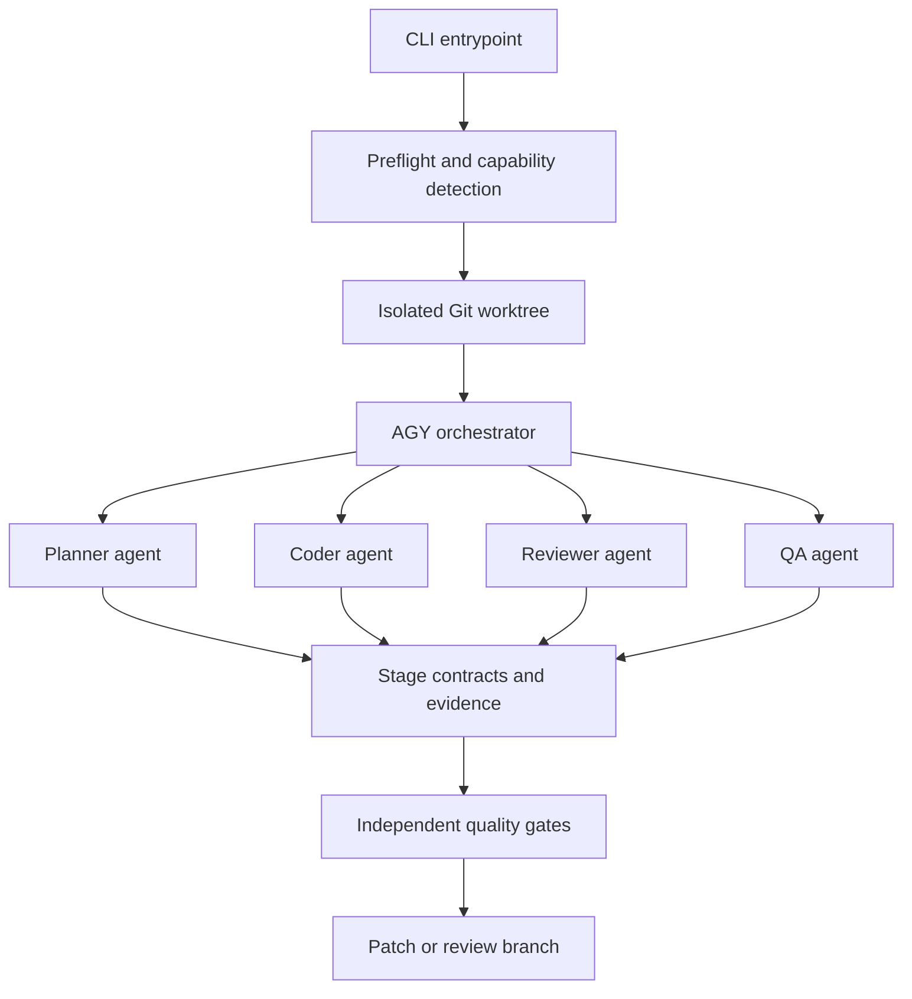

# PRD — agy-kit Production-Grade Coding Harness v1.0

> Status: Proposed  
> Baseline reviewed: `6158dbee692325be94419a0d1981c7885834cbbb`  
> Target platform: Google Antigravity CLI (`agy`)  
> Target quality: 10/10 in every rubric dimension  
> Priority: P0 release-hardening

## 1. Executive summary

`agy-kit` must evolve from a documented sequential prompt runner into a verifiably safe, AGY-native, multi-agent coding harness. The v1.0 release must use only public Antigravity CLI contracts, discover real custom agents and skills, execute a repeatable Plan → Build → Gate → QA → Review lifecycle, isolate all mutations from the user's primary worktree, and generate evidence that an independent evaluator can reproduce from a clean clone.

The product must not award itself a passing score merely because files or keywords exist. A capability is considered implemented only when a behavioral test proves it through observable input, execution, output, and failure handling.

## 2. Problem statement

The current repository has strong process design and documentation, but several advertised capabilities are not yet backed by the official AGY runtime contract or executable evidence:

- Custom agents are mirrored as JSON, while AGY discovers Markdown agents with YAML frontmatter.
- Many workflows and examples still call unsupported `agy run --agent ...` commands.
- The fixed Makefile uses valid headless syntax but sends every stage to the default agent, so specialist role execution is not proven.
- The benchmark suite currently fails its own meta-evaluation and still contains self-referential or hardcoded measurements.
- The rollback mechanism still mutates the user's primary worktree and has failure paths that bypass rollback.
- Unsafe execution is enabled by default through `--dangerously-skip-permissions`.
- CI validates repository structure more strongly than it validates real harness behavior.

## 3. Product vision

Provide a small, auditable, deterministic orchestration layer around Antigravity CLI that helps teams run spec-driven software delivery with specialist agents while preserving human control, source-code safety, traceability, and reproducibility.

The desired experience is:

```text
clone/install → doctor → plan → approve → build → gate → QA → review → deliver patch
```

Every stage must be independently resumable, produce a machine-readable contract, and fail closed.

## 4. Goals

### G-001 — Native AGY compatibility

Use only documented Antigravity CLI commands, customization paths, agent formats, model tiers, MCP configuration, and permission behavior.

### G-002 — Real specialist-agent execution

Prove that planner, coder, reviewer, and QA are loaded by AGY and that each role executes with its declared instructions and tool restrictions.

### G-003 — Safe transactional mutation

Never run an autonomous modifying stage inside the user's primary worktree. Failed or cancelled runs must leave the original worktree byte-for-byte unchanged.

### G-004 — Behavioral quality evidence

Replace self-certifying checks with unit, integration, contract, mutation, and live smoke tests whose results can be reproduced from a clean clone.

### G-005 — Fail-closed delivery

Lint, test, security, traceability, compatibility, or safety failures must produce a non-zero exit code and block release.

### G-006 — Honest metrics

Report only observed values. If token, cost, coverage, or runtime data is unavailable, report `unknown`/`not_collected`; never substitute hardcoded sample values and award full credit.

### G-007 — Production-grade developer experience

Offer safe defaults, clear commands, actionable failures, dry-run support, deterministic artifacts, migration guidance, and a compatibility matrix.

## 5. Non-goals

- Reimplementing the Antigravity agent runtime.
- Depending on undocumented AGY flags or private schemas.
- Guaranteeing semantic correctness of arbitrary generated applications.
- Automatically pushing, merging, deploying, or modifying remote repositories.
- Supporting every language in v1.0. The five advertised adapters are required; new languages are post-v1.0.
- Claiming enterprise compliance certification. The project may document controls and evidence, not certify itself.

## 6. Users and primary use cases

### Personas

| Persona | Need |
|---|---|
| Individual developer | Safely delegate a feature while retaining review control |
| Tech lead | Enforce planning, testing, security, and traceability across agent-generated changes |
| Platform engineer | Run the harness reproducibly in CI and inspect structured evidence |
| Maintainer | Add or update agents, skills, workflows, and adapters without breaking runtime compatibility |
| Auditor/reviewer | Reproduce quality claims from a clean clone without trusting committed reports |

### Core use cases

1. Initialize `agy-kit` in an existing repository without overwriting files.
2. Verify local AGY version, authentication, models, agents, skills, MCP servers, and required language tools.
3. Generate a specification without modifying application code.
4. Approve a specification before implementation.
5. Implement a feature using TDD in an isolated worktree.
6. Run static analysis, dependency scanning, tests, and QA.
7. Produce a reviewed patch/branch and an evidence bundle.
8. Resume a failed or interrupted run from the last valid stage.
9. Run offline contract tests with a fake AGY executable.
10. Run authenticated AGY smoke tests in an explicitly enabled environment.

## 7. Product principles

1. **Official contract first:** undocumented behavior is treated as unsupported.
2. **Isolation before autonomy:** no modifying agent runs in the primary worktree.
3. **Safe by default:** approval or sandbox mode is the default; unsafe mode is explicit opt-in.
4. **Evidence over assertion:** every capability maps to an executable test and retained artifact.
5. **Fail closed:** missing tools, malformed output, incomplete evidence, or unrecognized runtime versions block the affected gate.
6. **No synthetic success:** `unknown` is preferable to a fabricated metric.
7. **Single source of truth:** avoid mirrored directories unless synchronization is generated and verified.
8. **Least privilege:** stage permissions and mutation manifests are enforced outside the model prompt.
9. **Reproducible from clean clone:** committed generated reports cannot determine their own pass status.
10. **Human-controlled delivery:** success produces a reviewable patch or branch, never an automatic merge.

## 8. Target architecture



### Runtime boundaries

- **Primary repository:** read-only to the harness after startup, except for an explicitly requested final patch application.
- **Run worktree:** disposable and scoped to one run ID.
- **Evidence directory:** append-only for the duration of a run.
- **Agent customization:** official `.agents/` paths and formats only.
- **Evaluator:** does not trust committed reports and recomputes results.

### Canonical repository layout

```text
.agents/
  agents/
    planner.md
    coder.md
    reviewer.md
    qa.md
  skills/
    <skill>/SKILL.md
  mcp_config.json
  workflows/
    <workflow>.md
agy-kit/
  schemas/
    run-manifest.schema.json
    stage-result.schema.json
    evidence.schema.json
  adapters/
    python.sh
    typescript.sh
    go.sh
    rust.sh
    php.sh
  orchestrator/
  safety/
bin/
tests/
  unit/
  integration/
  contract/
  fixtures/
  smoke/
docs/
```

Legacy `.antigravity/` and `.hermes/` copies must either be removed or generated from the canonical `.agents/` source. Hand-maintained triple copies are prohibited.

## 9. Functional requirements

### 9.1 AGY runtime compatibility

#### FR-AGY-001 — Version and capability preflight [P0]

The harness must run `agy --version` and inspect `agy --help` before executing a pipeline.

Acceptance criteria:

- A supported version range is declared in one machine-readable file.
- Unsupported versions fail with a clear message and upgrade/downgrade guidance.
- Required capabilities are detected rather than assumed.
- The test suite includes fake outputs for supported, unsupported, malformed, and missing AGY installations.

#### FR-AGY-002 — Official headless invocation [P0]

All non-interactive calls must use documented AGY flags such as `-p/--print`. Unsupported strings including `agy run`, `--agent`, and `--auto-approve` must not appear in executable documentation, workflows, examples, scripts, or generated output.

Acceptance criteria:

```bash
rg -n 'agy run|--agent|--auto-approve' \
  README.md AGENTS.md Makefile bin docs examples .agents
```

returns no matches, excluding an explicitly named migration-history fixture.

#### FR-AGY-003 — Native custom-agent format [P0]

Planner, coder, reviewer, and QA must be defined as `.agents/agents/<name>.md` files with valid YAML frontmatter.

Required frontmatter:

- `name`
- `description`
- `tools`
- `mainAgent`
- `subagent`
- `model` using supported tiers only: `inherit`, `flash`, or `pro`
- `commandExecutionPolicy`

Acceptance criteria:

- AGY `/agents` or an equivalent documented discovery interface lists all four agents.
- Each agent can be selected or invoked in a smoke test.
- Invalid agent frontmatter produces a failing contract test.
- JSON agent definitions are not presented as AGY-native agent files.

Reference: <https://antigravity.google/docs/subagents>

#### FR-AGY-004 — Specialist-stage execution [P0]

Each pipeline stage must demonstrably invoke the intended specialist agent. Prefixing a prompt with `[planner]` or `[reviewer]` is not sufficient evidence.

Acceptance criteria:

- Stage telemetry records the resolved agent name.
- The planner is unable to modify application code through external enforcement.
- The coder is unable to mutate files outside the approved manifest.
- The reviewer runs with application paths read-only unless an explicit `--apply-fixes` mode is enabled.
- QA writes only tests, reproductions, and evidence.
- A contract test fails if every stage resolves to the default agent.

If the installed AGY version cannot select a custom agent directly in headless mode, the orchestrator must use a documented `invoke_subagent` mechanism or fail with `capability_not_supported`. It must not silently downgrade while continuing to advertise multi-agent execution.

#### FR-AGY-005 — Skills discovery [P0]

Workspace skills must live at `.agents/skills/<name>/SKILL.md` and conform to AGY skill requirements.

Acceptance criteria:

- Every skill has valid YAML frontmatter and a non-empty trigger-oriented description.
- AGY `/skills` or equivalent discovery evidence lists every required skill.
- A behavioral test proves at least one domain skill and one methodology skill are activated for matching prompts.
- Skills are not counted merely because files exist.

Reference: <https://antigravity.google/docs/skills>

#### FR-AGY-006 — MCP configuration [P0]

The canonical workspace MCP configuration must be `.agents/mcp_config.json` and must be validated against current documented behavior.

Acceptance criteria:

- JSON syntax and required fields are schema-validated.
- Missing referenced executables fail doctor checks.
- Secrets are provided through environment variables or secure providers only.
- Local servers are pinned to reviewed versions; unbounded `npx -y <latest>` is prohibited in production mode.
- A live smoke test proves at least one harmless MCP server appears in `/mcp` and responds.

#### FR-AGY-007 — Native workflows [P1]

Workflows must use the current AGY workflow format and must contain instructions for the active agent, not nested calls to nonexistent AGY commands.

Acceptance criteria:

- Every advertised slash workflow is discoverable and executable.
- `/plan`, `/pipeline`, `/gate`, `/qa`, and `/review` each have a smoke test.
- Workflow files remain under the platform-documented size limit.
- Workflow-to-workflow calls use supported slash invocation semantics.

Reference: <https://antigravity.google/docs/rules-workflows>

### 9.2 Pipeline orchestration

#### FR-PIPE-001 — Explicit stage state machine [P0]

The orchestrator must implement these states:

```text
CREATED → PREFLIGHT → ISOLATED → PLANNED → APPROVED → BUILT
→ GATED → QA_PASSED → REVIEWED → PACKAGED → COMPLETED
```

Any state may transition to `FAILED`, `CANCELLED`, or `TIMED_OUT`. Implementation cannot begin without `APPROVED` unless the user explicitly selects a documented non-interactive approval policy.

#### FR-PIPE-002 — Structured stage contracts [P0]

Every stage must emit JSON conforming to `stage-result.schema.json`.

Minimum fields:

```json
{
  "run_id": "uuid",
  "stage": "plan|build|gate|qa|review",
  "agent": "planner|coder|reviewer|qa",
  "status": "passed|failed|blocked|cancelled",
  "started_at": "RFC3339",
  "finished_at": "RFC3339",
  "input_commit": "sha",
  "output_commit": "sha-or-null",
  "files_changed": [],
  "commands_run": [],
  "checks": [],
  "evidence": [],
  "errors": []
}
```

Malformed, missing, or semantically inconsistent output must fail the stage.

#### FR-PIPE-003 — Plan approval gate [P0]

The plan stage must produce:

- SPEC
- requirements traceability matrix
- mutation manifest
- test plan
- security considerations
- rollback plan
- explicit non-goals

Application code must remain unchanged until approval is recorded.

#### FR-PIPE-004 — Idempotency and resume [P1]

- Re-running a completed read-only stage must not create duplicate artifacts.
- A run may resume only when its baseline commit and evidence hashes still match.
- Resume after source divergence must stop and require a new run or explicit rebase.
- State writes must be atomic.

#### FR-PIPE-005 — Timeouts and retry policy [P1]

- Every external command and agent stage has a configurable timeout.
- Retries apply only to classified transient failures.
- Deterministic test failures are not retried automatically.
- Retry count, reason, delay, and final outcome are recorded.
- Default maximum retry count is three.

#### FR-PIPE-006 — Dry-run mode [P1]

`agy-kit pipeline --dry-run` must display resolved stages, agents, tools, commands, worktree path policy, expected artifacts, permission mode, and timeouts without invoking AGY or modifying Git state.

### 9.3 Git and filesystem safety

#### FR-SAFE-001 — Isolated worktree execution [P0]

All modifying stages must run inside a temporary Git worktree created from an immutable baseline SHA.

Required behavior:

1. Validate repository and baseline.
2. Create a unique temporary directory using `mktemp -d`.
3. Create an isolated branch or detached worktree.
4. Run agents and tests only inside that worktree.
5. On failure, remove only the recorded worktree.
6. On success, produce a patch or named review branch.
7. Never run `git reset --hard`, `git clean`, or `git stash` in the primary worktree.

Acceptance criteria:

- A dirty primary worktree with tracked, staged, untracked, ignored, renamed, and spaced filenames is unchanged after success, failure, cancellation, and timeout.
- Hashes of all primary-worktree files before and after are identical.
- Existing user stashes are unchanged.
- Concurrent runs cannot remove or drop one another's branches, stashes, or worktrees.

#### FR-SAFE-002 — Canonical path enforcement [P0]

All user-derived paths must be canonicalized and checked against an allowlisted root before filesystem mutation.

Required negative tests:

- `../` traversal
- absolute paths
- symlink escape
- newline and control characters
- spaces and Unicode
- rename status entries
- filenames beginning with `-`
- nested Git repositories

#### FR-SAFE-003 — Mutation manifest enforcement [P0]

The coder and QA may change only paths declared by the approved manifest. Enforcement must compare pre/post filesystem state outside the model and fail before packaging if an undeclared path changes.

#### FR-SAFE-004 — Safe cleanup [P0]

- Cleanup targets must be explicit recorded paths.
- No broad unresolved glob, root path, home path, or empty variable may reach a destructive command.
- Cleanup must be idempotent.
- Cleanup failure must be reported without broadening the deletion scope.

#### FR-SAFE-005 — Safe installer [P0]

The installer must:

- default to non-destructive behavior;
- refuse to overwrite existing files;
- support `--dry-run`;
- require `--force` plus explicit file list for overwrites;
- create a recoverable backup when overwriting;
- validate target directory and language;
- install canonical `.agents` assets rather than stale mirrors;
- produce a machine-readable installation manifest.

### 9.4 Permission and security model

#### FR-SEC-001 — Safe permission default [P0]

The default must be AGY's review or sandbox behavior. `--dangerously-skip-permissions` must be available only through explicit opt-in, display a prominent warning, and be recorded in evidence.

Acceptance criteria:

- Default commands contain no dangerous bypass flag.
- CI unsafe mode requires a dedicated protected variable.
- An unsafe run is visibly labeled and cannot be reported as equivalent to a reviewed run.

Reference: <https://antigravity.google/docs/cli/permissions>

#### FR-SEC-002 — Secret detection [P0]

Secret scanning must cover:

- full current tree;
- Git history or configured comparison range;
- staged, unstaged, and untracked files in the isolated worktree;
- generated evidence and logs.

Tests must include multiple token formats, multiline private keys, encoded secrets, false positives, allowlist expiry, and redaction behavior.

#### FR-SEC-003 — Dependency integrity [P0]

- Use ecosystem-native audit tools: `pip-audit`/`uv audit` where supported, `npm audit`, `govulncheck`, `cargo audit`, and `composer audit`.
- Lockfiles are required for runnable examples and harness dependencies.
- External actions and critical tools are pinned to immutable versions or commit SHAs.
- Generate an SBOM for releases.
- A missing scanner is a failure in release CI, not a warning interpreted as success.

#### FR-SEC-004 — Command construction [P0]

Avoid `shell=True` and interpolated shell commands for user-derived values. Use argument arrays and explicit working directories. Where shell execution is unavoidable, inputs must be validated and covered by injection tests.

#### FR-SEC-005 — Log redaction [P0]

Logs and evidence must redact secrets, authorization headers, environment values, signed URLs, cookies, and personal access tokens before persistence.

### 9.5 Testing and evaluation

#### FR-TEST-001 — Test pyramid [P0]

The repository must contain real test suites:

| Layer | Minimum scope |
|---|---|
| Unit | Parsers, schemas, path checks, state transitions, command construction, cost calculation |
| Shell | Installer, worktree lifecycle, cleanup, exit codes, signal handling |
| Contract | AGY help/version parsing, agent/skill/workflow schemas, stage-result schemas |
| Integration | Full pipeline against deterministic fake AGY |
| Fixture E2E | Real build/test cycle for Python, TypeScript, Go, Rust, and PHP fixtures |
| Live smoke | Authenticated AGY discovery and one minimal feature pipeline |
| Mutation | Prove critical safety and evaluator assertions fail when inverted or removed |

#### FR-TEST-002 — Deterministic fake AGY [P0]

Provide a fake `agy` executable capable of simulating:

- supported and unsupported versions;
- valid and invalid custom-agent discovery;
- valid, malformed, empty, and delayed output;
- agent failure and timeout;
- unexpected file mutation;
- permission denial;
- secret leakage;
- transient network failure;
- cancellation signal.

This enables complete CI without external credentials while validating orchestration behavior rather than keywords.

#### FR-TEST-003 — Live AGY smoke suite [P0 for release]

A protected CI or release environment must run against a supported real AGY version and prove:

1. `agy --version` matches the compatibility matrix.
2. Four custom Markdown agents are discovered.
3. Required skills are discovered.
4. At least one MCP server is healthy.
5. Planner produces a spec without source mutation.
6. Coder changes only declared fixture files.
7. Reviewer detects an injected defect.
8. QA runs and records evidence.
9. Final fixture tests pass.
10. Primary worktree remains unchanged.

If credentials are unavailable, the release is blocked or explicitly marked pre-release; the suite cannot be silently skipped for a production tag.

#### FR-TEST-004 — Meta-evaluation independence [P0]

The meta-evaluator must test public result contracts rather than private field names shared ad hoc with the implementation.

Acceptance criteria:

- Results are schema-validated.
- Fault injection covers at least: committed secret, untracked secret, Python syntax, shell syntax, malformed JSON/YAML, missing agent, wrong agent format, unsupported CLI flag, path escape, symlink escape, undeclared mutation, test failure, missing scanner, timeout, malformed stage output, and fake hardcoded telemetry.
- A mutation-testing job proves each critical detector is capable of failing.
- Meta-tests are updated in the same change as result-schema changes.

#### FR-TEST-005 — Honest benchmark scoring [P0]

Each metric must expose:

- observed value;
- collection method;
- evidence reference;
- threshold;
- status: `passed`, `failed`, `not_collected`, or `not_applicable`.

Rules:

- `not_collected` never earns points.
- Static file existence cannot prove runtime functionality.
- Generated reports are written to a non-versioned output directory.
- A committed prior report is never used as current input.
- Overall 100/100 is possible only when all blocking live and offline gates pass.

#### FR-TEST-006 — Coverage thresholds [P1]

- Core Python orchestration: at least 90% line and 85% branch coverage.
- Safety/path/worktree modules: 100% branch coverage for destructive decision paths.
- Shell scripts: every branch exercised through Bats or an equivalent harness.
- Coverage exclusions require documented rationale.

### 9.6 CI/CD and release engineering

#### FR-CI-001 — Fail-closed CI [P0]

Required PR checks:

1. formatting
2. Ruff lint
3. mypy/type checking
4. ShellCheck
5. shell formatting check
6. actionlint
7. unit tests
8. contract tests
9. fake-AGY integration tests
10. five-language fixture tests
11. secret scanning
12. dependency audits
13. mutation-manifest/path safety tests
14. documentation command verification

No required command may be followed by `|| true`, fallback `echo`, or an unconditional success path.

#### FR-CI-002 — CI matrix [P1]

Test at minimum:

- Ubuntu latest and macOS latest;
- supported Python versions;
- supported AGY minimum and latest versions where binaries are available;
- Bash version used by supported platforms;
- five advertised language fixtures.

#### FR-CI-003 — Reproducible dependencies [P0]

- Define project dependencies in a standard manifest and lockfile.
- Provide one documented bootstrap command.
- Pin GitHub Actions to immutable commit SHAs for releases.
- Cache keys include lockfile hashes.
- CI can be reproduced locally in a documented container or runner.

#### FR-CI-004 — Release gate [P0]

A production release requires:

- all required CI checks green;
- live AGY smoke evidence;
- compatibility matrix update;
- SBOM;
- signed tag or release provenance;
- changelog and migration notes;
- no P0/P1 known defect affecting safety or core execution;
- independent reproduction from a clean clone.

### 9.7 Observability and cost

#### FR-OBS-001 — Structured run events [P1]

Emit redacted JSONL events with run ID, stage, agent, timestamps, duration, command exit code, retry classification, artifact hash, and result.

#### FR-OBS-002 — Real token and cost telemetry [P1]

- Consume actual AGY/trace usage when available.
- Store price tables separately with source and effective date.
- Distinguish observed usage from estimates.
- Unknown models or missing usage produce `not_collected`, not a default full-credit estimate.
- No benchmark may use hardcoded sample tokens as an observed pipeline result.

#### FR-OBS-003 — Run summary [P1]

Every run produces a summary containing:

- baseline and result commit;
- stages and resolved agents;
- changed files;
- tests and security checks;
- failures/retries;
- observed duration and usage;
- permission mode;
- evidence checksums;
- patch or review branch location.

### 9.8 Documentation and developer experience

#### FR-DOC-001 — Executable documentation [P0]

All commands in README, tutorials, examples, workflows, and upgrade guides must be extracted and verified in CI where practical. Unsupported historical syntax must be confined to a clearly labeled migration document.

#### FR-DOC-002 — Honest capability language [P0]

Terms such as “production-ready”, “enterprise-grade”, “native”, “100/100”, and “complete” may appear only when linked to current reproducible evidence. Pre-release documentation must describe unverified features as experimental.

#### FR-DOC-003 — Compatibility matrix [P0]

Document:

- agy-kit version;
- tested AGY versions;
- agent, skill, MCP, workflow behavior;
- supported operating systems;
- supported language toolchains;
- known limitations;
- date of last live verification.

#### FR-DOC-004 — Quick start [P0]

A new user must be able to reach a successful fixture pipeline from a clean machine using no more than five documented commands, excluding prerequisite installation/authentication.

#### FR-DOC-005 — Troubleshooting [P1]

Provide actionable recovery steps for missing AGY, auth failure, unsupported version, agent not discovered, skill not discovered, MCP failure, dirty worktree, timeout, scanner absence, test failure, and interrupted cleanup.

### 9.9 Maintainability and governance

#### FR-MNT-001 — Single schema source [P0]

Agent definitions, stage schemas, workflow manifests, and skill lists must have one canonical source. Generated mirrors must include a generated-file notice and a reproducible sync command. CI must fail on drift.

#### FR-MNT-002 — Typed implementation [P1]

Core orchestration logic must use typed data structures instead of unstructured dictionaries and shell parsing. Public JSON artifacts must be versioned and schema-validated.

#### FR-MNT-003 — Contribution gates [P1]

Every behavioral change requires:

- a linked requirement ID;
- a failing regression test before the fix;
- compatibility impact assessment;
- safety impact assessment;
- documentation update when the user contract changes.

#### FR-MNT-004 — Deprecation policy [P1]

Deprecated flags, paths, schemas, or artifacts must have a documented replacement, warning period, migration tool, and removal version.

## 10. Non-functional requirements

| ID | Area | Requirement |
|---|---|---|
| NFR-001 | Reliability | 100 consecutive fake-AGY pipelines must complete with zero nondeterministic failures |
| NFR-002 | Safety | Primary worktree must remain unchanged across all tested failure and signal paths |
| NFR-003 | Performance | Harness overhead excluding AGY/model time must be <2 seconds p95 for preflight and <5 seconds p95 for packaging |
| NFR-004 | Security | Zero high/critical dependency findings at release; exceptions require documented expiry and owner |
| NFR-005 | Portability | Core workflow must pass on supported Ubuntu and macOS runners |
| NFR-006 | Maintainability | Core modules meet coverage thresholds and strict type checking |
| NFR-007 | Observability | 100% of stages emit valid start and terminal events |
| NFR-008 | Recoverability | Interrupted runs leave enough state to diagnose and either resume safely or start a new run |
| NFR-009 | Usability | Doctor failures identify exact missing capability and corrective action |
| NFR-010 | Reproducibility | Two clean runs with fake AGY and the same inputs produce equivalent contracts and patches |

## 11. Quality rubric: conditions for 10/10

No category may receive 10/10 based solely on documentation or file existence.

| Category | Weight | Required evidence for 10/10 |
|---|---:|---|
| Architecture and product design | 10% | State machine, contracts, boundaries, ADRs, no contradictory source of truth |
| AGY compatibility | 20% | Official formats plus real discovery and live smoke on supported versions |
| Testing and evaluation | 20% | Test pyramid, negative tests, mutation tests, live smoke, honest scoring |
| Safety and security | 20% | Worktree isolation, path enforcement, safe defaults, full secret/dependency scans |
| CI and release engineering | 10% | Clean-clone fail-closed matrix, reproducible dependencies, release evidence |
| Documentation and DX | 10% | Verified commands, five-command quick start, compatibility and troubleshooting docs |
| Maintainability and observability | 10% | Typed contracts, single sources, coverage, structured events, actual metrics |

Scoring rules:

- Any open P0 requirement caps the affected category at 5/10.
- Any destructive primary-worktree behavior caps Safety at 0/10 and Overall at 5/10.
- Any unsupported AGY command or undiscoverable advertised agent caps Compatibility at 4/10.
- A failing required CI check caps CI at 4/10.
- Hardcoded metrics presented as observed values cap Testing and Observability at 3/10.
- A skipped live smoke test prevents a production release and caps Compatibility at 8/10.
- Overall 10/10 requires every category to score 10/10; a weighted average cannot hide a deficient category.

## 12. Acceptance test matrix

| Test ID | Scenario | Expected result |
|---|---|---|
| AT-001 | Clean clone, supported AGY | Doctor passes and reports observed version/capabilities |
| AT-002 | Missing AGY | Non-zero exit; no Git mutation; actionable install message |
| AT-003 | Unsupported AGY | Non-zero exit; compatibility guidance |
| AT-004 | Agent discovery | Four `.md` agents listed by AGY |
| AT-005 | Skill discovery | Required skills listed and activatable |
| AT-006 | MCP smoke | Harmless MCP server healthy and callable |
| AT-007 | Planner isolation | SPEC created; application source unchanged |
| AT-008 | Coder manifest | Declared paths change; undeclared path is blocked |
| AT-009 | Reviewer defect detection | Injected security or correctness defect blocks review |
| AT-010 | QA evidence | Fixture E2E test produces redacted evidence and valid contract |
| AT-011 | Dirty primary tree, success | All original tracked/staged/untracked/ignored files unchanged |
| AT-012 | Dirty primary tree, agent failure | Primary tree unchanged; isolated worktree cleaned safely |
| AT-013 | Dirty primary tree, test failure | Primary tree unchanged; failure evidence preserved |
| AT-014 | SIGINT/SIGTERM | Controlled cancellation; no primary-tree mutation |
| AT-015 | Concurrent runs | Unique worktrees/run IDs; no cross-run cleanup |
| AT-016 | Path traversal | Request rejected before filesystem mutation |
| AT-017 | Symlink escape | Request rejected and recorded |
| AT-018 | Untracked secret | Secret scan fails and evidence is redacted |
| AT-019 | Committed historical secret | Release security gate fails |
| AT-020 | Missing scanner | Release gate fails, local doctor explains installation |
| AT-021 | Malformed agent Markdown | Contract test and AGY discovery test fail |
| AT-022 | Unsupported CLI string reintroduced | Static contract check fails |
| AT-023 | Malformed stage JSON | Stage fails closed |
| AT-024 | Missing usage telemetry | Report says `not_collected`, awards no metric points |
| AT-025 | Meta-eval detector mutated | Mutation suite kills the mutation |
| AT-026 | Python fixture | Full plan/build/gate/QA loop passes |
| AT-027 | TypeScript fixture | Full plan/build/gate/QA loop passes |
| AT-028 | Go fixture | Full plan/build/gate/QA loop passes |
| AT-029 | Rust fixture | Full plan/build/gate/QA loop passes |
| AT-030 | PHP fixture | Full plan/build/gate/QA loop passes |
| AT-031 | Installer on populated directory | Refuses overwrite without `--force`; dry-run is accurate |
| AT-032 | Documentation command extraction | All supported examples parse and pass appropriate smoke checks |
| AT-033 | 100-run stability | Zero flaky failures with deterministic fake AGY |
| AT-034 | Clean-clone release rehearsal | All gates and artifact verification pass |

## 13. Delivery phases

### Phase 0 — Stop false-positive release claims [P0]

- Mark current release experimental.
- Remove or qualify “A+”, “enterprise production grade”, and unconditional `100/100` claims.
- Make generated evaluation reports non-authoritative and non-input artifacts.
- Fix the current meta-evaluation regression.

Exit criteria: clean clone runs required offline tests without contradictory success claims.

### Phase 1 — AGY-native contract migration [P0]

- Convert agents from JSON to Markdown/YAML.
- Canonicalize `.agents/skills` and MCP configuration.
- Rewrite workflows as native instructions.
- Remove all unsupported CLI syntax.
- Add capability and discovery tests.

Exit criteria: real AGY lists four agents and required skills; no stale executable syntax remains.

### Phase 2 — Safe orchestrator [P0]

- Implement explicit state machine and schemas.
- Introduce worktree isolation.
- Enforce mutation manifests and canonical paths.
- Make safe permissions the default.
- Add signal-safe cleanup and concurrency tests.

Exit criteria: primary worktree invariance suite passes every success/failure/cancellation scenario.

### Phase 3 — Independent test and evaluation system [P0]

- Add deterministic fake AGY.
- Add unit, shell, contract, integration, fixture, and mutation tests.
- Replace hardcoded metrics.
- Add schema-versioned evidence.

Exit criteria: offline CI is green and every critical detector is proven by negative or mutation tests.

### Phase 4 — Live compatibility and five-language proof [P0/P1]

- Add protected real-AGY smoke CI.
- Make five fixtures complete and independently runnable.
- Publish compatibility matrix and evidence hashes.

Exit criteria: all five fixtures and real AGY smoke pass from a clean release candidate.

### Phase 5 — v1.0 release hardening [P1]

- Complete docs, installer safeguards, SBOM, provenance, migration guide, performance/stability runs, and release rehearsal.

Exit criteria: every rubric category independently satisfies its 10/10 gate.

## 14. Migration requirements

- Provide a migration command that converts supported legacy JSON agent definitions into reviewable Markdown drafts; never overwrite existing custom agents.
- Preserve legacy files only as backup or documented source input, not as active duplicate configuration.
- Detect stale `.antigravity`/`.hermes` copies and explain canonical precedence.
- Document breaking changes from v0.7.x to v1.0.
- Add tests using a real v0.7.x fixture repository.

## 15. Risks and mitigations

| Risk | Impact | Mitigation |
|---|---|---|
| AGY CLI contract changes | Discovery or invocation breaks | Version range, capability detection, minimum/latest smoke matrix |
| Headless custom-agent selection unsupported | Specialist stages silently degrade | Fail with explicit capability error or use documented `invoke_subagent`; never pretend |
| Model nondeterminism | Flaky semantic assertions | Assert contracts and invariants; use fake AGY for deterministic orchestration tests |
| Unsafe cleanup | User data loss | Worktree isolation, explicit recorded cleanup targets, destructive-path tests |
| Credential cost/availability | Live smoke skipped | Protected scheduled/release job; no production tag without evidence |
| Mirror drift | Wrong skills/agents loaded | Canonical source plus generated artifacts and drift CI |
| Overly complex process | Slow adoption | Safe defaults, profiles, dry-run, concise quick start, optional gates for local iteration |

## 16. Definition of Done

The project is complete only when all conditions below are true:

- [ ] All P0 and P1 requirements are implemented.
- [ ] `make verify-eval` and the replacement canonical test command pass from a clean clone.
- [ ] Four custom Markdown agents are discovered by a supported real AGY build.
- [ ] Required skills and workflows are discovered and exercised.
- [ ] No unsupported AGY command remains outside migration-history fixtures.
- [ ] Default execution does not use `--dangerously-skip-permissions`.
- [ ] No modifying stage runs in the primary worktree.
- [ ] Primary-worktree invariance tests pass for success, failure, cancellation, timeout, and concurrency.
- [ ] All path, secret, dependency, output-contract, and mutation-manifest negative tests pass.
- [ ] Fake-AGY integration suite passes 100 consecutive runs without variance.
- [ ] Five language fixture pipelines pass.
- [ ] Real AGY smoke suite passes in the release environment.
- [ ] Core coverage and safety branch thresholds are met.
- [ ] Token/cost reports contain only observed or explicitly labeled estimated data.
- [ ] CI is fail-closed and all required checks are green.
- [ ] Compatibility matrix, quick start, troubleshooting, migration, and rollback documentation are verified.
- [ ] Release includes SBOM, evidence checksums, changelog, and provenance.
- [ ] An independent reviewer reproduces every 10/10 category score from a clean clone.

## 17. Implementation request to give a coding agent

Use the following instruction together with this PRD:

> Implement `PRD.md` in the declared delivery phases. Begin by creating a technical specification and requirements traceability matrix that maps every `FR-*`, `NFR-*`, and `AT-*` ID to concrete files and tests. Do not change application or harness code until the Phase 0/Phase 1 design is approved. Use RED → GREEN → REFACTOR for every behavioral change. Treat official Antigravity documentation as the runtime contract; do not invent flags, schemas, paths, or capabilities. Run all modifying work in an isolated Git worktree. Do not use `git reset --hard`, `git clean`, or `git stash` in the user's primary worktree. Do not claim completion based on file existence, keyword matching, committed reports, or hardcoded metrics. A phase is complete only when its acceptance tests pass from a clean clone and evidence is attached. Stop and report a blocker if real AGY cannot prove an advertised capability.

## 18. Authoritative platform references

- Custom agents and discovery: <https://antigravity.google/docs/subagents>
- CLI subagents: <https://antigravity.google/docs/cli/subagents>
- Agent skills: <https://antigravity.google/docs/skills>
- Permissions and sandboxing: <https://antigravity.google/docs/cli/permissions>
- Rules and workflows: <https://antigravity.google/docs/rules-workflows>
- CLI reference: <https://antigravity.google/docs/cli/reference>
- CLI best practices: <https://antigravity.google/docs/cli/best-practices>

These references must be rechecked at implementation and release time because AGY is versioned and may change.
