# Business Analysis, Quality Assurance & Reliability Framework

> **Scaffold:** `agy-kit`  
> **Version:** 2.0.0 (Phase 10 Standard)  
> **Status:** Production Standard  
> **Target CLI:** Antigravity CLI (`agy`)

---

## 1. 5-Stage Software Delivery & BA-QA Pipeline Overview

The `agy-kit` Business Analysis (BA), Quality Assurance (QA) & System Reliability Framework establishes a closed-loop, deterministic 5-stage software delivery pipeline. It enforces 1:1 requirement traceability from business request (`R-001`), 12-Dimensional Business Edge Case Matrix (`ACM`), Non-Functional Requirements (`NFR`), Data Flow Diagrams (`DFD`), unit tests, security gates, E2E dogfooding, and git commits.

### 1.1 Pipeline Architecture & State Flow Diagram

```mermaid
flowchart TD
    subgraph Stage1 [Stage 1: Plan & Business Analysis]
        A[User Feature Request] --> B[Planner Subagent]
        B --> C[Extract Explicit & Implicit REQs]
        C --> D[Build RTM, ACM 12-Edge Matrix, NFR, DFD]
        D --> E[Domain Entity Modeling & Ubiquitous Language]
        E --> F[Generate plans/SPEC_feature.md + RTM + ACM]
        F --> G[Reviewer Subagent: plan-review approval gate]
    end

    subgraph Stage2 [Stage 2: Edge Case & TDD Engineering]
        G --> H[Coder Subagent]
        H --> I[Parse RTM R-xxx & 12-Dimensional ACM Matrix]
        I --> J[RED: Write Unit/Integration Tests mapped to R-xxx]
        J --> K[GREEN: Implement Minimal Logic]
        K --> L[REFACTOR: Clean Code under SOLID & DRY rules]
    end

    subgraph Stage3 [Stage 3: Layered Quality Gate Audit]
        L --> M[Reviewer Subagent]
        M --> N[L1 Static Analysis & Lint Scan]
        N --> O[OWASP-AI 5-Point Security Check]
        O --> P[Hardcoded Secret & Supply Chain Audit]
    end

    subgraph Stage4 [Stage 4: Live Dogfooding & E2E QA]
        P --> Q[QA Subagent]
        Q --> R[Launch Local Server Environment]
        R --> S[Execute Playwright / cURL Dogfooding Scenarios]
        S --> T[Capture Raw Evidence in tests/qa-evidence/]
    end

    subgraph Stage5 [Stage 5: 3-State Verification & Review]
        T --> U[Reviewer Subagent]
        U --> V[3-State Verification Audit: Confirmed / Plausible / Refuted]
        V --> W[Run bin/validate-traceability.sh & validate-phase10-ba-qa.sh]
        W --> X[Form Conventional Commits & Push]
    end
```



### 1.2 Subagent Role Assignments

| Stage | Subagent Role | Primary Model | Key Deliverable / Artifact |
|-------|--------------|---------------|----------------------------|
| **Stage 1: Plan & BA** | `planner` | `zai/glm-5.2` | `plans/SPEC_<feature>.md` (containing RTM, 12-ACM, NFR, DFD) + `plan-review` stamp |
| **Stage 2: TDD** | `coder` | `gemini-3.6-flash-high` | Source code + Test suites in `src/` and `tests/` + `tests/red/<feature>.log` |
| **Stage 3: Quality Gate** | `reviewer` | `zai/glm-5.2` | Clean linter / L1-L5 Quality scan / OWASP security scan results |
| **Stage 4: E2E QA** | `qa` | `gemini-3.6-flash-low` | Raw execution logs in `tests/qa-evidence/<feature_name>/` + QA Report |
| **Stage 5: Review & Commit** | `reviewer` | `zai/glm-5.2` | 3-State Verification audit report & Git commit |

---

## 2. Stage 1: Business Analysis & Requirement Traceability Matrix (RTM)

Business Analysis translates ambiguous feature requests into unambiguous, verifiable requirement schemas.

### 2.1 Requirement Traceability Matrix (RTM) Schema

Every specification MUST define a Requirement Traceability Matrix table (`plans/RTM_<feature>.md`). Requirements use the monotonically increasing `R-<NNN>` ID format:

| Req ID | Requirement Description | Source | Priority | Target Component / File | Unit Test Reference | E2E QA Evidence Mapping | Status |
|--------|------------------------|--------|----------|-------------------------|---------------------|-------------------------|--------|
| `R-001` | User registration with valid email & password | UX-Interview | P0 | `src/auth/register.ts` | `tests/test_auth.py::test_r001_register_success` | `tests/qa-evidence/auth/curl_register.log` | Pending |
| `R-002` | Enforce rate limit (max 100 req/min per IP) | Arch-NFR | P1 | `src/middleware/rate_limit.ts` | `tests/test_rate_limit.py::test_r002_rate_limit_exceeded` | `tests/qa-evidence/auth/curl_rate_limit.log` | Pending |

### 2.2 BDD Acceptance Criteria & Given-When-Then Syntax

Requirements MUST be formalized using Behavior-Driven Development (BDD) Given-When-Then syntax:
```gherkin
Scenario: Successful User Registration (R-001)
  Given an unauthenticated client with valid registration details
  When the client sends POST /api/v1/auth/register with email and password
  Then the response status code must be 201 Created
  And the response body must contain user_id and a valid JWT token.
```

### 2.3 User Journeys, Domain Modeling & Schemas

Specifications must outline domain entities, ubiquitous language, and Zod/Pydantic validation schemas:
- **Domain Entities:** Identify key model structs/interfaces and permitted state transitions.
- **Ubiquitous Language:** Standardize glossary terms across code and spec.
- **Validation Schemas:** Declare strict input/output Zod (TypeScript) or Pydantic (Python) validation schemas.

---

## 3. Stage 2: 12-Dimensional Business Edge Case Matrix (ACM) & TDD

### 3.1 The 12-Dimensional Edge Case Matrix (ACM)

Subagents MUST evaluate and test requirements against all 12 Business Edge-Case dimensions:

| # | Category | Description & Scenario Focus | Mitigation & Code Pattern |
|---|----------|------------------------------|---------------------------|
| 1 | **Null / Missing** | Missing optional keys, `undefined`, null payload | Zod / Pydantic schema fallback defaults |
| 2 | **Precision Loss** | Currency float rounding loss | Integer cent representation (`amount_in_cents`) |
| 3 | **Concurrency** | Parallel request state mutation | Optimistic DB Locking (`version` column / ETag) |
| 4 | **Rate Limit** | Request burst flooding | Token Bucket Rate Limiter |
| 5 | **Schema Drift** | Legacy client request schema | Dual-schema payload transformer / Adapter |
| 6 | **Idempotency** | Duplicate submit on network retry | Header `X-Idempotency-Key` deduplication |
| 7 | **Partial Failure** | Main DB write succeeds, email notify fails | Transactional Outbox Pattern |
| 8 | **Security Fallback**| Auth provider outage | Fail-Closed Mode (default deny all access) |
| 9 | **Context Overflow**| Input exceeding LLM context window | Payload truncation & length validation |
| 10| **Resource Leak** | Unclosed DB handle or stream | RAII pattern with `try-finally` cleanup |
| 11| **Tenant Leak** | Cross-tenant data retrieval | Row-Level Security (RLS) + TenantID scoping |
| 12| **Task Interrupt** | Subagent crash mid-turn | Atomic Checkpoint File (`.agy/session.json`) |

---

## 4. Stage 3: Layered Quality Framework & OWASP Security Audit

Phase 10 organizes quality into five concentric layers (L1–L5):
- **L1 Static Analysis:** Linter (0 errors, 0 warnings), strict typechecking, secret scan clean.
- **L2 Unit / Contract Tests:** One test file per public unit, RED phase evidence under `tests/red/`, ≥85% line and ≥70% branch coverage.
- **L3 Integration Tests:** Agent boundary contract verification.
- **L4 End-to-End (E2E QA):** Driven by `qa` subagent via cURL / Playwright dogfooding.
- **L5 Release Quality:** Final sign-off by `reviewer` subagent.

### OWASP-AI 5-Point Security Checklist:
1. **OWASP-AI-01 Slopsquatting & Package Security:** Lockfile dependency validation.
2. **OWASP-AI-02 IDOR / BOLA:** Tenant & resource ownership checks on queries.
3. **OWASP-AI-03 Injection Vulnerabilities:** Parameterized SQL, no `eval` or shell injection.
4. **OWASP-AI-04 Hardcoded Secrets:** Zero hardcoded tokens or private keys in code.
5. **OWASP-AI-05 Excessive Agency:** Workspace path sandboxing and tool permissions verification.

---

## 5. Stage 4: Live Dogfooding & E2E API Verification

The `qa` subagent executes empirical verification against live running instances. Raw logs are captured in `tests/qa-evidence/<feature_name>/` and checked against RTM IDs.

---

## 6. Stage 5: 3-State Verification & System Reliability

### 6.1 The 3 Verification States

Every subagent claim during code review MUST be classified into one of three empirical states:
- **`Confirmed` (Pass):** Supported by direct, unedited execution logs, passing unit test outputs, or recorded QA response evidence.
- **`Plausible` (Blocked until verified):** Logical code change that appears correct upon static inspection but lacks automated test proof. MUST be converted to `Confirmed` before commit.
- **`Refuted` (Rejected):** Assertion contradicted by failing test output, linter error, or security scan finding. Requires immediate fix or rollback.

### 6.2 System Reliability & Deterministic Rollback

- **Rollback Contract:** If tests fail after 3 retries, auto-rollback code to the last clean git checkpoint (`git stash`).
- **Bounded Execution:** Session capped at max 15 turns and 30 minutes wall-clock time per agent call.
- **Max Files Per Turn:** Capped at 20 modified files per turn.
- **Session State Persistence:** Persist state across turns to `.agy/session.json` and `.agy/events.jsonl`.
- **Validation Execution:** Run `bin/validate-phase10-ba-qa.sh` and `bin/validate-traceability.sh` before commit.
