# Business Analysis & Quality Assurance Framework

> **Scaffold:** `agy-kit`  
> **Version:** 1.0.0  
> **Status:** Production Standard  
> **Target CLI:** Antigravity CLI (`agy`)

---

## 1. 5-Stage Software Delivery Pipeline Overview

The `agy-kit` Business Analysis (BA) & Quality Assurance (QA) Framework establishes a closed-loop, deterministic 5-stage software delivery pipeline. It enforces 1:1 requirement traceability from business request to unit tests, security gates, E2E dogfooding, and git commits.

### 1.1 Pipeline Architecture & State Flow Diagram

```mermaid
flowchart TD
    subgraph Stage1 [Stage 1: Plan & Business Analysis]
        A[User Feature Request] --> B[Planner Subagent]
        B --> C[Extract Explicit & Implicit REQs]
        C --> D[Build Requirement Traceability Matrix RTM]
        D --> E[Domain Entity Modeling & User Journeys]
        E --> F[Generate plans/SPEC_feature.md]
    end

    subgraph Stage2 [Stage 2: Edge Case & TDD Engineering]
        F --> G[Coder Subagent]
        G --> H[Parse RTM & 6-Category Edge Case Matrix]
        H --> I[RED: Write Unit/Integration Tests mapped to REQ-xxx]
        I --> J[GREEN: Implement Minimal Logic]
        J --> K[REFACTOR: Clean Code under SOLID & DRY rules]
    end

    subgraph Stage3 [Stage 3: OWASP-AI Quality Gate Audit]
        K --> L[Reviewer Subagent]
        L --> M[Linter & Typecheck Scan]
        M --> N[OWASP-AI 5-Point Security Check]
        N --> O[Hardcoded Secret & Supply Chain Audit]
    end

    subgraph Stage4 [Stage 4: Live Dogfooding & E2E QA]
        O --> P[QA Subagent]
        P --> Q[Launch Local Server Environment]
        Q --> R[Execute Playwright / cURL Dogfooding Scenarios]
        R --> S[Capture Raw Evidence in tests/qa-evidence/]
    end

    subgraph Stage5 [Stage 5: 3-State Verification & Review]
        S --> T[Reviewer Subagent]
        T --> U[3-State Verification Audit: Confirmed / Plausible / Refuted]
        U --> V[Run bin/validate-traceability.sh]
        V --> W[Form Conventional Commits & Push]
    end
```



### 1.2 Subagent Role Assignments

| Stage | Subagent Role | Primary Model | Key Deliverable / Artifact |
|-------|--------------|---------------|----------------------------|
| **Stage 1: Plan & BA** | `planner` | `zai/glm-5.2` | `plans/SPEC_<feature>.md` (containing RTM & Edge Case Matrix) |
| **Stage 2: TDD** | `coder` | `gemini-3.6-flash-high` | Source code + Test suites in `src/` and `tests/` |
| **Stage 3: Quality Gate** | `reviewer` | `zai/glm-5.2` | Clean linter / OWASP security scan results |
| **Stage 4: E2E QA** | `qa` | `gemini-3.6-flash-low` | Raw execution logs in `tests/qa-evidence/<feature_name>/` |
| **Stage 5: Review & Commit** | `reviewer` | `zai/glm-5.2` | 3-State Verification audit report & Git commit |

---

## 2. Stage 1: Business Analysis & Requirement Traceability Matrix (RTM)

Business Analysis translates ambiguous feature requests into unambiguous, verifiable requirement schemas.

### 2.1 Requirement Traceability Matrix (RTM) Schema

Every specification MUST define a Requirement Traceability Matrix table. Requirements are categorized into two types:
1. **Explicit Requirements:** Direct functional requests from the user story or business specification.
2. **Implicit Requirements:** Non-functional or structural system attributes mandatory for system health (e.g. rate-limiting, error handling, path sanitization, concurrency locks, audit logging).

#### RTM Schema Format

| Req ID | Requirement Description | Type | Target Component / File | Unit Test Reference | E2E QA Evidence Mapping | Status |
|--------|------------------------|------|-------------------------|---------------------|-------------------------|--------|
| `REQ-001` | User registration with valid email & password | Explicit | `src/auth/register.ts` | `tests/auth_test.py::test_req_001_register_success` | `tests/qa-evidence/auth/curl_register.log` | Pending |
| `REQ-002` | Enforce rate limit (max 5 requests/min per IP) | Implicit | `src/middleware/rate_limit.ts` | `tests/rate_limit_test.py::test_req_002_rate_limit_exceeded` | `tests/qa-evidence/auth/curl_rate_limit.log` | Pending |

### 2.2 User Journeys & Domain Modeling

Specifications must outline domain entities and step-by-step actor interactions using ubiquitous domain language.
- **Domain Entities:** Identify key model structs/interfaces, entity attributes, and permitted state transitions (e.g. `Draft -> Active -> Archived`).
- **User Journeys:** Sequence of interactions from the actor's perspective:
  `Actor [Unauthenticated User] -> Submit Registration Payload -> Middleware Validates Input -> Password Hashed -> Database User Record Created -> Return JWT Token`.

### 2.3 BDD Acceptance Criteria

Requirements MUST be formalized using BDD (Behavior-Driven Development) Given-When-Then syntax:
```gherkin
Scenario: Successful User Registration
  Given an unauthenticated client with valid registration details
  When the client sends POST /api/v1/auth/register with email and password
  Then the response status code must be 201 Created
  And the response body must contain user_id and a valid JWT token.
```

---

## 3. Stage 2: Edge Case & TDD Engineering

### 3.1 The 6-Category Edge Case Matrix

Software failure typically occurs at system boundaries and unexpected states. Subagents must evaluate and design test scenarios across all 6 Edge Case categories:

| Category | Description & Test Scenario Focus | Example Payload / Condition | Expected Result & Code |
|----------|----------------------------------|-----------------------------|-----------------------|
| **1. Null / Empty** | Missing required payload keys, `null`, `undefined`, empty string `""`, empty array `[]`. | `{ "email": "" }` or `{}` | HTTP 400 Validation Error |
| **2. Boundary / Limits** | Max length payload (10KB+), integer overflow/underflow, zero values, negative bounds. | `password = "a" * 10000` | HTTP 400 / 413 Payload Too Large |
| **3. State Mutation** | Invalid state transitions, modifying locked/deleted entities, double submission. | Submitting order completion on already cancelled order. | HTTP 409 Conflict / 422 Invalid State |
| **4. Auth / Scope Bypass** | Missing bearer token, expired token, cross-tenant IDOR resource access attempt. | `Authorization: Bearer invalid` or accessing tenant B ID as tenant A. | HTTP 401 Unauthorized / 403 Forbidden |
| **5. Concurrent / Race** | Parallel request contention, race conditions on resource creation/locking. | 5 simultaneous `POST` requests with identical email. | 1 succeeds (HTTP 201), 4 fail (HTTP 409) |
| **6. Malicious / Injection** | SQLi payloads (`' OR 1=1 --`), XSS payloads (`<script>alert(1)</script>`), Path traversal (`../../etc/passwd`). | `email = "' OR 1=1 --"` | HTTP 400 Sanitized / Invalid Input |

### 3.2 SOLID & DRY Architectural Constraints

Code implemented by `coder` subagent MUST strictly adhere to:
- **Single Responsibility Principle (SRP):** Each module or class handles exactly one concern (e.g. route controller separate from business logic).
- **Open-Closed Principle (OCP):** Extend functionality via middleware or interfaces without modifying existing core logic.
- **Interface Segregation (ISP):** Clients depend only on interfaces they actually use.
- **Don't Repeat Yourself (DRY):** Zero duplicate logic blocks; shared validation utilities must be extracted into reusable helper modules.

---

## 4. Stage 3: OWASP-AI 5-Point Security Audit

Before code advances to QA, the `reviewer` subagent executes an automated OWASP-AI security audit across 5 vector categories:

1. **OWASP-AI-01 Slopsquatting & Package Security:**
   - Scan all new dependencies against lockfiles (`package-lock.json`, `poetry.lock`, etc.).
   - Reject unverified or hallucinated package names.
2. **OWASP-AI-02 IDOR / BOLA (Insecure Direct Object Reference):**
   - Verify every endpoint fetching or mutating a database record validates tenant/user ownership of the resource ID.
3. **OWASP-AI-03 Injection Vulnerabilities:**
   - Require parameterized SQL queries.
   - Prohibit `eval()`, unsafe deserialization, shell execution with `shell=True` on dynamic user input.
4. **OWASP-AI-04 Hardcoded Secrets & Credentials:**
   - Run `gitleaks` or regex scanners to prevent hardcoded passwords, tokens, private keys, or API credentials.
5. **OWASP-AI-05 Excessive Agency & Sandboxing:**
   - Verify tool actions operate within workspace boundaries.
   - Enforce path scoping and prevent directory traversal.

---

## 5. Stage 4: Live Dogfooding & E2E API Verification

The `qa` subagent executes empirical verification against live running instances.

### 5.1 Execution Procedure

1. **Start Environment:** Launch local dev server in background mode (e.g. `node server.js` or `python main.py`).
2. **Health Check:** Ping health check endpoint (`GET /health`) until HTTP 200 is confirmed.
3. **Execute E2E Dogfooding:** Run Playwright browser automation or cURL scripts matching the RTM requirement IDs.
4. **Evidence Collection:** Record HTTP request/response headers, status codes, and body output.
5. **Save Evidence Artifacts:** Persist raw logs into `tests/qa-evidence/<feature_name>/` (e.g. `tests/qa-evidence/auth/curl_register.log`).

---

## 6. Stage 5: 3-State Verification & Traceability Audit

To eliminate false assertions, every subagent claim during code review MUST be classified into one of three empirical states:

### 6.1 The 3 Verification States

```
                 ┌──────────────────────────────────────────────┐
                 │          Subagent Code Claim                 │
                 └──────────────────────┬───────────────────────┘
                                        │
                    Is there empirical execution proof?
                                        │
                   ┌────────────────────┴────────────────────┐
                  YES                                       NO
                   │                                         │
        Does test log pass?                          Does logic appear correct?
         ┌─────────┴─────────┐                         ┌─────┴─────┐
        YES                 NO                        YES          NO
         │                   │                         │           │
  ▼              ▼                         ▼           ▼
[Confirmed]     [Refuted]                 [Plausible]  [Refuted]
 (Pass)          (Block/Fix)               (Must Verify) (Block/Fix)
```

- **`Confirmed` (Pass):** Supported by direct, unedited execution logs, passing unit test outputs, or recorded QA response evidence.
- **`Plausible` (Blocked until verified):** Logical code change that appears correct upon static inspection but lacks automated test proof. MUST be converted to `Confirmed` before commit.
- **`Refuted` (Rejected):** Assertion contradicted by failing test output, linter error, or security scan finding. Requires immediate fix or rollback.

### 6.2 Traceability Validation Workflow

Run `bin/validate-traceability.sh` to ensure complete end-to-end alignment:
```bash
make check-traceability
```
The script validates that all SPECs in `plans/` define RTM tables, Edge Case matrices, and 3-State Verification criteria, ensuring zero untracked code modifications.
