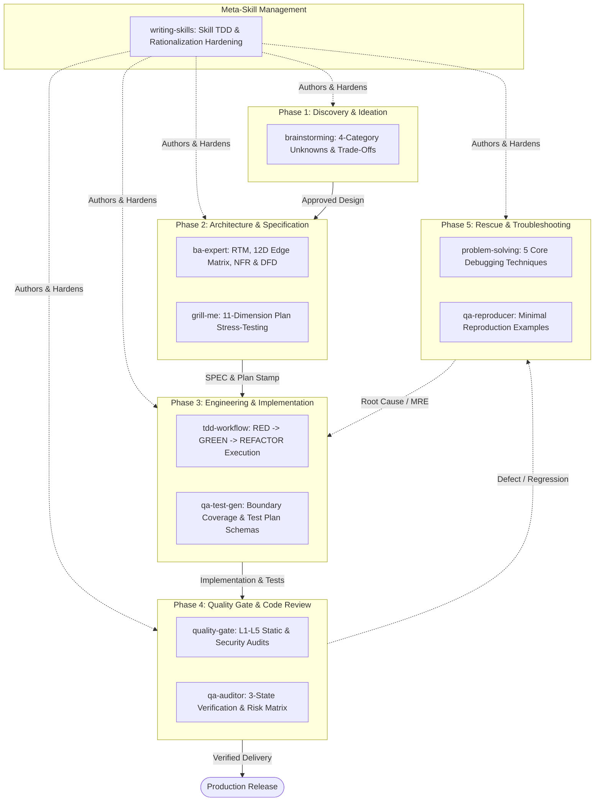

# agy-kit Skills Completeness Matrix & Lifecycle Phase Mapping

> **Scaffold:** `agy-kit`  
> **Version:** 20.0.0 (Phase 20 Complete Standard)  
> **Status:** Production Standard  
> **Directive Alignment:** `AGY-DIR-020` (Phase 20 Directive)  
> **Target CLI:** Antigravity CLI (`agy`)  

---

## 1. Executive Summary

The `agy-kit` Skills Completeness Matrix provides 100% lifecycle coverage across all software delivery phases. The 10 native skills form a closed-loop system of procedural guidance, domain modeling, automated quality verification, stress-testing, troubleshooting, and self-improving meta-skill authoring.

Every native skill is dual-mirrored across `.hermes/skills/` and `.antigravity/skills/` to support both Hermes agent runtimes and Antigravity CLI subagents without context drift.

### Core Invariant
> **No phase in the software engineering lifecycle is unguided or unmonitored. Every requirement, line of code, quality gate, failure reproduction, and meta-skill modification is governed by an explicit native skill and verified by automated evaluation harnesses.**

---

## 2. Lifecycle Architecture & State Flow Diagram



---

## 3. Master Skills Completeness Matrix

| Lifecycle Phase | Skill Name | Core Function & Capability | Primary Subagent | Trigger / Command | Key Deliverable / Artifact | Automated Validation Script |
|---|---|---|---|---|---|---|
| **Phase 1: Discovery & Ideation** | `brainstorming` | 4-category unknown classification (Known knowns, Known unknowns, Unknown knowns, Unknown unknowns) & 2–4 trade-off design variants. | `planner` | `/brainstorm`, vague/novel feature requests | Design Variant RFC, Approved Architecture Concept | `bin/validate-brainstorm-skills.sh` |
| **Phase 2: Architecture & Specification** | `ba-expert` | RTM generation, 12-Dimensional Edge Case Matrix (ACM), BDD Given-When-Then criteria, NFRs, and DFD modeling. | `planner` | Spec writing, architecture changes | `plans/SPEC_<feature>.md`, `plans/RTM_<feature>.md` | `bin/validate-traceability.sh`, `bin/validate-phase10-ba-qa.sh` |
| **Phase 2: Architecture & Specification** | `grill-me` | Adversarial 11-dimension stress testing (assumptions, failure modes, 10x scale, rollback, non-goals). | `reviewer` | `/grill`, pre-implementation spec review | Plan-Review Stamp, Risk Scrutiny Log | `bin/validate-brainstorm-skills.sh` |
| **Phase 3: Engineering & Implementation** | `tdd-workflow` | Enforces strict RED (failing test proof) → GREEN (minimal logic) → REFACTOR (clean code) cycle. | `coder` | `/build`, coding tasks, feature implementation | Unit/Integration tests, `tests/red/<feature>.log` | `tests/evals/eval_harness.py` |
| **Phase 3: Engineering & Implementation** | `qa-test-gen` | Generates boundary test cases, edge-case coverage rules, property-based tests, and JSON Test Plan Schemas. | `coder` / `qa` | Test suite creation, edge-case coverage expansion | JSON Test Plan Schema, Property & Boundary Test Suite | `bin/validate-phase10-ba-qa.sh` |
| **Phase 4: Quality Gate & Code Review** | `quality-gate` | Enforces 0 linter errors/warnings, type checking, secret scan, OWASP security audit, and coverage thresholds. | `reviewer` | `/gate`, pre-commit, pre-merge audit | L1-L5 Quality Gate Audit Report | `bin/verify-eval-harness.sh`, `bin/scan-dependencies.sh` |
| **Phase 4: Quality Gate & Code Review** | `qa-auditor` | Performs JSON audit contracts, Runtime Risk Matrix assessments, static code reviews, and 3-State Verification. | `reviewer` | `/review`, code review stage | JSON Audit Contract, 3-State Verification Audit Log | `bin/validate-workflows-sync.sh`, `bin/validate-phase10-ba-qa.sh` |
| **Phase 5: Rescue & Troubleshooting** | `problem-solving` | Resolves complexity spirals and recurring bugs via 5 core techniques (Simplification Cascades, Collision-Zone Thinking, etc.). | `coder` / `qa` | `/solve`, execution blocks, complex debugging | Root Cause Analysis, Refactored Architecture Plan | `bin/validate-brainstorm-skills.sh` |
| **Phase 5: Rescue & Troubleshooting** | `qa-reproducer` | Constructs Minimal Reproduction Examples (MRE), JSON Bug Reproduction Schemas, and failure isolation pipelines. | `qa` | Defect triage, failing test isolation | MRE Script, JSON Bug Reproduction Schema | `bin/validate-workflows-sync.sh`, `bin/validate-phase10-ba-qa.sh` |
| **Meta-Skill Management** | `writing-skills` | Authors and maintains skills using TDD (RED -> GREEN -> REFACTOR), rationalization hardening, and anti-pattern prevention. | `planner` / `reviewer` | New skill authoring, skill refactoring | `SKILL.md` (validated, mirrored in `.hermes/` & `.antigravity/`) | `tests/evals/eval_harness.py` (Phase 17 benchmark) |

---

## 4. Phase-by-Phase Skill Mapping & Deep-Dive

### 4.1 Phase 1: Discovery & Ideation
- **Primary Skill:** `brainstorming`
- **Objective:** Prevent premature coding and flawed assumptions by systematically exploring the problem space before drafting specs.
- **Workflow & Rules:**
  1. Categorize all project unknowns into the 4-quadrant matrix:
     - **Known Knowns:** Confirmed constraints and verified requirements.
     - **Known Unknowns:** Identified risks requiring decision or research.
     - **Unknown Knowns:** Implicit assumptions needing explicit surface verification.
     - **Unknown Unknowns:** Potential hidden edge cases and environmental variables.
  2. Formulate 2–4 distinct implementation variants with explicit pros/cons, trade-offs, and token/performance overheads.
  3. **Hard Gate:** No code writing or detailed SPEC creation allowed until user approves a chosen design variant.

### 4.2 Phase 2: Architecture & Specification
- **Primary Skills:** `ba-expert`, `grill-me`
- **Objective:** Transform ideation concepts into rigorous, traceable specifications and subject them to adversarial scrutiny.
- **Workflow & Rules:**
  - `ba-expert`:
    1. Draft `plans/SPEC_<feature>.md` with RTM mapping business requests (`R-001`) to unit and E2E tests.
    2. Populate the **12-Dimensional Business Edge Case Matrix (ACM)** covering: Null/Empty, Boundary, Concurrency, Idempotency, Partial Failure, Auth, Data Integrity, Resource Exhaustion, Clock/Timezone, i18n, Backward Compatibility, and Silent Failure.
    3. Define BDD Given-When-Then acceptance criteria and Data Flow Diagrams (DFD).
  - `grill-me`:
    1. Subject the SPEC to an 11-dimension stress test (testing hidden assumptions, failure modes under 10x scale, rollback feasibility, non-goals).
    2. Require explicit answers for every scrutiny dimension before granting the `plan-review` stamp.

### 4.3 Phase 3: Engineering & Implementation
- **Primary Skills:** `tdd-workflow`, `qa-test-gen`
- **Objective:** Implement features using strict test-driven development and complete boundary test generation.
- **Workflow & Rules:**
  - `tdd-workflow`:
    1. **RED:** Write unit/integration tests failing against current logic. Capture failing execution output log in `tests/red/<feature>.log`.
    2. **GREEN:** Write the minimal implementation code required to pass all failing tests.
    3. **REFACTOR:** Refactor source code under SOLID and DRY principles while maintaining 100% test pass status.
  - `qa-test-gen`:
    1. Synthesize boundary and edge-case test suites covering all 12 ACM dimensions.
    2. Output structured JSON Test Plan Schemas for automated execution.

### 4.4 Phase 4: Quality Gate & Code Review
- **Primary Skills:** `quality-gate`, `qa-auditor`
- **Objective:** Guarantee security, code quality, static analysis compliance, and behavior verification before merging.
- **Workflow & Rules:**
  - `quality-gate`:
    1. Execute static analysis and linting (0 errors, 0 warnings).
    2. Execute secret scans (gitleaks/trufflehog patterns) and OWASP-AI 5-point security checks.
    3. Enforce code coverage thresholds (≥95% line coverage, ≥90% branch coverage).
  - `qa-auditor`:
    1. Generate JSON Audit Contracts evaluating runtime risk matrices.
    2. Apply **3-State Verification** to audit claims:
       - **Confirmed:** Verified with direct execution evidence.
       - **Plausible:** Logically consistent but pending live trace.
       - **Refuted:** Contradicted by test logs or static analysis.

### 4.5 Phase 5: Rescue & Troubleshooting
- **Primary Skills:** `problem-solving`, `qa-reproducer`
- **Objective:** Provide rapid, structured intervention when encountering unexpected bugs, test failures, or architectural stalls.
- **Workflow & Rules:**
  - `problem-solving`:
    1. Apply one of 5 core techniques when stuck:
       - **Simplification Cascades:** Strip non-essential code until the bug isolates.
       - **Collision-Zone Thinking:** Analyze boundary interfaces between sub-components.
       - **Meta-Pattern Recognition:** Compare symptom against historical error patterns.
       - **Inversion Exercise:** Attempt to force-reproduce the failure by reversing assumptions.
       - **Scale Game:** Test behavior at 10x and 0.1x parameters.
  - `qa-reproducer`:
    1. Construct a Minimal Reproduction Example (MRE) script.
    2. Output a structured JSON Bug Reproduction Schema detailing exact failure conditions and state requirements.

### 4.6 Meta-Skill Management
- **Primary Skill:** `writing-skills`
- **Objective:** Govern the authoring, refinement, and pressure-testing of skills within the system.
- **Workflow & Rules:**
  1. Apply TDD principles to skill creation:
     - **RED:** Run subagent without skill; record baseline failure.
     - **GREEN:** Author minimal SKILL.md; verify subagent succeeds.
     - **REFACTOR:** Harden skill against rationalization loopholes and adversarial inputs.
  2. Enforce dual-path synchronization: any edit to `.hermes/skills/<skill>/SKILL.md` must be identically mirrored to `.antigravity/skills/<skill>/SKILL.md`.

---

## 5. Dual-Path Skill Synchronization Architecture

`agy-kit` operates a dual-path skill architecture to accommodate both native Hermes AI Agent sessions and Antigravity CLI (`agy`) subagent workflows:

```
agy-kit Root
 ├── .hermes/skills/       <-- Hermes Agent Runtime Skills Directory
 │    ├── brainstorming/
 │    ├── ba-expert/
 │    ├── grill-me/
 │    ├── tdd-workflow/
 │    ├── qa-test-gen/
 │    ├── quality-gate/
 │    ├── qa-auditor/
 │    ├── problem-solving/
 │    ├── qa-reproducer/
 │    └── writing-skills/
 └── .antigravity/skills/  <-- Antigravity CLI (agy) Subagent Skills Directory
      ├── brainstorming/
      ├── ba-expert/
      ├── grill-me/
      ├── tdd-workflow/
      ├── qa-test-gen/
      ├── quality-gate/
      ├── qa-auditor/
      ├── problem-solving/
      ├── qa-reproducer/
      └── writing-skills/
```

### Synchronization Verification
Automated validation scripts (`bin/validate-workflows-sync.sh`, `bin/validate-brainstorm-skills.sh`, `bin/validate-phase10-ba-qa.sh`) run `cmp -s` on every skill file across `.hermes/skills/` and `.antigravity/skills/` to guarantee 100% byte-for-byte identity.

---

## 6. Validation & Automation Infrastructure

Completeness and compliance across all 10 native skills are enforced by automated test scripts and the benchmark evaluation harness:

1. `./bin/verify-eval-harness.sh` — Runs the meta-evaluation suite, 5 synthetic fault injection scenarios, 10x stability test, and latency profiler.
2. `./bin/validate-brainstorm-skills.sh` — Verifies Phase 12 ideation (`brainstorming`), stress testing (`grill-me`), and troubleshooting (`problem-solving`) skills and workflows.
3. `./bin/validate-workflows-sync.sh` — Verifies workflow files, agent JSON specs, and 100% skill mirroring across all 10 native skills.
4. `./bin/validate-traceability.sh` — Verifies 1:1 requirement traceability in `plans/SPEC_*.md` files.
5. `./bin/validate-phase10-ba-qa.sh` — Verifies BA & QA framework documentation, `ba-expert`, `qa-auditor`, `qa-test-gen`, and `qa-reproducer` skills.
6. `./bin/validate-agents.sh` — Validates JSON schema syntax and skill alignment across `planner.json`, `coder.json`, `reviewer.json`, and `qa.json`.
7. `./bin/agy-doctor.sh` — Performs system health diagnostics, toolchain verification, and environment checks.
8. `python3 tests/evals/eval_harness.py` — Runs the 16 core benchmarks (expanded for complete phase coverage) and generates `latest_eval_report.json`.

---

## 7. Quality Gate Pyramid & Metric Compliance

The 10 skills interlock with the 5-level (L1–L5) Quality Gate Pyramid defined in `AGY-DIR-020`:

| Pyramid Level | Gate Type | Governing Skill(s) | Target Metric / Threshold |
|---|---|---|---|
| **L1** | Unit & Static Analysis | `tdd-workflow`, `quality-gate` | 0 linter errors/warnings, ≥95% line coverage, ≥70% mutation score |
| **L2** | Integration Testing | `tdd-workflow`, `qa-test-gen` | All cross-module boundaries exercised, 0 regression failures |
| **L3** | API Contract Verification | `ba-expert`, `qa-auditor` | 100% API schema validation (Zod/Pydantic), 0 contract breaks |
| **L4** | End-to-End Dogfooding | `qa-auditor`, `qa-reproducer` | 100% BDD Given-When-Then acceptance criteria verified |
| **L5** | Chaos & Property Testing | `problem-solving`, `grill-me` | Resilience invariants hold under synthetic fault injection |

---

**End of Skills Completeness Matrix — Phase 20 Standard.**
