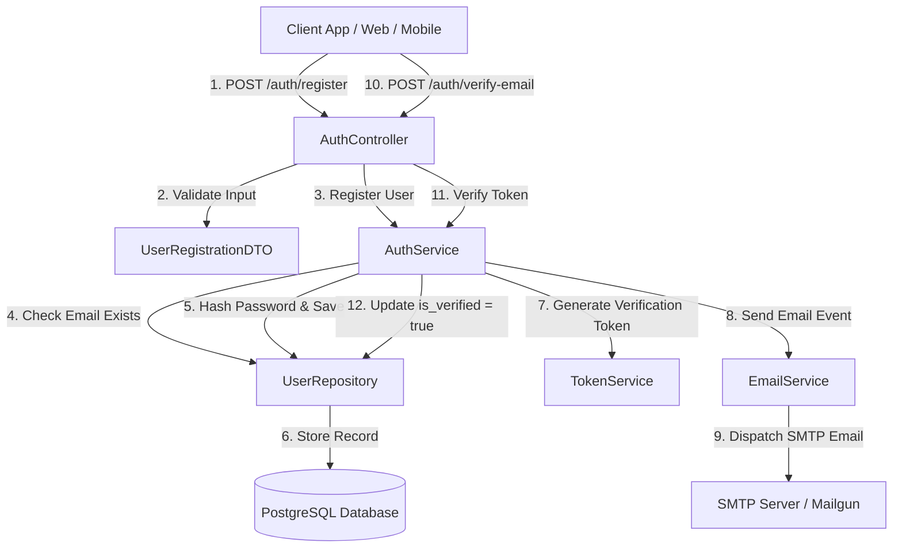

# SPEC: User Registration with Email Verification

> **Status:** Approved  
> **Author:** Planner Agent  
> **Date:** 2026-08-06  

---

## 1. Executive Summary

### Goals
- Cung cấp API endpoint `POST /api/v1/auth/register` cho phép người dùng mới đăng ký tài khoản bằng email, mật khẩu và họ tên.
- Tự động mã hóa mật khẩu bằng bcrypt (cost factor = 12) trước khi lưu vào DB.
- Tự động sinh verification token an toàn (HMAC-SHA256, thời hạn 24h) và gửi email xác nhận chứa link kích hoạt.
- Cung cấp API endpoint `POST /api/v1/auth/verify-email` nhận token và cập nhật trạng thái `is_verified = true`.
- Đảm bảo xử lý lỗi validation, trùng lặp email và hết hạn token chuẩn mực HTTP status codes.

### Non-Goals
- Đăng nhập qua mạng xã hội (OAuth2 Google/GitHub/Facebook) — sẽ thực hiện ở SPEC riêng.
- Đặt lại mật khẩu (Password Reset) và xác thực 2 yếu tố (2FA).
- Cấu hình template HTML email nâng cao (dùng plain-text + HTML template đơn giản ở phase này).

---

## 2. Architecture & Data Flow



- **Luồng dữ liệu chính:**
  1. Người dùng gửi payload `email`, `password`, `full_name`.
  2. `AuthController` kiểm tra định dạng dữ liệu (validation filter).
  3. `AuthService` kiểm tra trùng lặp email trong `UserRepository`.
  4. Mật khẩu được hash bằng Bcrypt/Argon2.
  5. User record được tạo với `is_verified = false`.
  6. `TokenService` tạo SHA-256 token có TTL 24 giờ.
  7. `EmailService` gửi email chứa link verification dạng `https://app.domain.com/verify?token=<token>`.
  8. Người dùng nhấn link, client gọi `POST /api/v1/auth/verify-email` với token.
  9. Hệ thống xác minh token, chuyển `is_verified = true` và hủy token.

---

## 3. Interface & Schema Specification

### API Endpoints

| Method | Path | Request Body | Response Body | Status Codes |
|--------|------|-------------|---------------|--------------|
| `POST` | `/api/v1/auth/register` | `{"email": "user@example.com", "password": "SecurePassword123!", "full_name": "Nguyen Van A"}` | `{"status": "success", "message": "User registered. Verification email sent.", "data": {"user_id": "usr_94a2b1c8", "email": "user@example.com", "is_verified": false}}` | `201 Created`, `400 Bad Request`, `409 Conflict`, `422 Unprocessable` |
| `POST` | `/api/v1/auth/verify-email` | `{"token": "vft_a8f9c1d2e3f4..."}` | `{"status": "success", "message": "Email verified successfully.", "data": {"verified_at": "2026-08-06T02:15:00Z"}}` | `200 OK`, `400 Bad Request`, `410 Gone` |

### Types / Schema Definitions (TypeScript / Pydantic equivalent)

```typescript
export interface UserRegistrationRequest {
  email: string; // Valid email pattern, max 255 chars
  password: string; // Min 8 chars, 1 uppercase, 1 lowercase, 1 number, 1 special char
  full_name: string; // 2 - 100 chars
}

export interface VerifyEmailRequest {
  token: string; // Exactly 64 hex characters
}

export interface UserResponse {
  user_id: string;
  email: string;
  full_name: string;
  is_verified: boolean;
  created_at: string;
}
```

### DB Migration Schema (`migrations/001_create_users_table.sql`)

```sql
CREATE TABLE IF NOT EXISTS users (
    id VARCHAR(36) PRIMARY KEY,
    email VARCHAR(255) NOT NULL UNIQUE,
    password_hash VARCHAR(255) NOT NULL,
    full_name VARCHAR(100) NOT NULL,
    is_verified BOOLEAN NOT NULL DEFAULT FALSE,
    verification_token VARCHAR(128) NULL,
    verification_token_expires_at TIMESTAMP WITH TIME ZONE NULL,
    created_at TIMESTAMP WITH TIME ZONE DEFAULT CURRENT_TIMESTAMP,
    updated_at TIMESTAMP WITH TIME ZONE DEFAULT CURRENT_TIMESTAMP
);

CREATE INDEX idx_users_email ON users(email);
CREATE INDEX idx_users_verification_token ON users(verification_token) WHERE is_verified = FALSE;
```

---

## 4. File Mutation Manifest

| Action | File | Rationale |
|--------|------|-----------|
| Create | `src/auth/auth_controller.py` | FastAPI endpoint handlers for `/register` and `/verify-email` |
| Create | `src/auth/auth_service.py` | Business logic for hashing, token generation, user creation |
| Create | `src/auth/schemas.py` | Pydantic request/response validation models |
| Create | `src/auth/repository.py` | SQLAlchemy database operations for User model |
| Create | `src/services/email_service.py` | Email dispatch service (SMTP / mock interface) |
| Create | `src/models/user.py` | SQLAlchemy ORM model definition for `users` table |
| Create | `migrations/versions/001_create_users_table.py` | Alembic DB migration script |
| Modify | `src/main.py` | Include auth_controller router in FastAPI main app |
| Create | `tests/test_auth_register.py` | Unit and integration tests for user registration & verification |

> **Ràng buộc:** Agent KHÔNG được sửa file ngoài manifest này.

---

## 5. Test Plan & Edge Cases

### Unit / Integration Tests (Given-When-Then)

| # | Given | When | Then |
|---|-------|------|------|
| 1 | Valid registration payload | `POST /api/v1/auth/register` | HTTP 201, return user_id, `is_verified = false`, email sent mock called |
| 2 | Duplicate email already in DB | `POST /api/v1/auth/register` | HTTP 409 Conflict, error message "Email already registered" |
| 3 | Invalid email format ("not-an-email") | `POST /api/v1/auth/register` | HTTP 422 Unprocessable Entity, validation details |
| 4 | Weak password ("12345") | `POST /api/v1/auth/register` | HTTP 422 Unprocessable Entity, password requirements listed |
| 5 | Valid unexpired verification token | `POST /api/v1/auth/verify-email` | HTTP 200 OK, DB `is_verified` becomes `true`, token set to NULL |
| 6 | Expired verification token (TTL > 24h) | `POST /api/v1/auth/verify-email` | HTTP 410 Gone / 400 Bad Request, message "Token expired" |
| 7 | Already verified token reused | `POST /api/v1/auth/verify-email` | HTTP 400 Bad Request, message "Invalid or already used token" |
| 8 | SQL Injection string in email field | `POST /api/v1/auth/register` | HTTP 422, sanitized safely by ORM parameterization |

### Boundary Values
- Email length: 5 chars (min `a@b.c`) to 254 chars (RFC standard limit).
- Password length: 8 chars (min) to 128 chars (max).
- Full name: Unicode characters, accented letters (e.g., "Nguyễn Văn Ánh"), emojis handled safely.

---

## 6. Backward Compatibility & Migration

- [x] **No breaking changes:** Đây là module mới hoàn toàn, không đụng đến schema hay API hiện có.
- [x] **Reversible DB migration:** File migration hỗ trợ `downgrade()` xóa bảng `users`.
- [x] **Feature flag:** Cấu hình `ENABLE_USER_REGISTRATION=true` trong enviroment vars.

---

## 7. Definition of Done

- [ ] All 8 test cases in Test Plan pass (`pytest tests/test_auth_register.py -vv`).
- [ ] Code coverage cho module auth ≥ 90%.
- [ ] Linter & Typecheck: `ruff check .` và `mypy src/` trả lời 0 error, 0 warning.
- [ ] Security scan: `gitleaks` clean, không hardcode secret key hay SMTP password.
- [ ] OWASP-AI audit: Bcrypt salt & cost factor >= 12, token SHA-256 securely generated using `secrets.token_hex(32)`.
- [ ] Git commit formatted theo Conventional Commits (`feat(auth): add user registration with email verification`).
