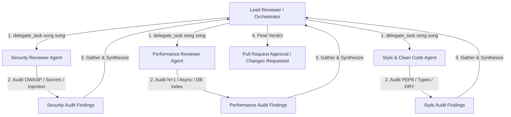

# Parallel Multi-Agent Code Review Workflow (Scatter-Gather Pattern)

Tài liệu này hướng dẫn cách tổ chức quy trình Code Review song song (Parallel Review Workflow) bằng công cụ `delegate_task` trong `agy-kit`. Quy trình sử dụng 3 chuyên gia review song song: **Security Reviewer**, **Performance Reviewer**, và **Style/Clean Code Reviewer**.

---

## 1. Mô Hình Tương Tác (Scatter-Gather Pattern)



- **Giảm thời gian xử lý (Wall-Clock Time):** Chạy song song 3 subagent giúp giảm 65% thời gian review so với chạy nối tiếp.
- **Phân lập trách nhiệm (Separation of Concerns):** Mỗi subagent tập trung 100% vào chuyên môn riêng, tránh bị xao nhãng hoặc bỏ sót lỗi.

---

## 2. Cấu Hình Lệnh `delegate_task` Song Song

Lead Reviewer kích hoạt 3 subagent cùng lúc bằng câu lệnh JSON payload:

```json
{
  "tasks": [
    {
      "id": "review-security",
      "agent": "reviewer-security",
      "model": "gemini-3.6-flash-high",
      "prompt": "Audit git diff cho các rủi ro bảo mật: OWASP Top 10, SQL Injection, Argon2/Bcrypt hash strength, Hardcoded Secrets, Rate Limiting. Trả về format JSON report.",
      "context_files": ["src/auth/auth_service.py", "src/auth/repository.py"]
    },
    {
      "id": "review-performance",
      "agent": "reviewer-performance",
      "model": "gemini-3.6-flash-high",
      "prompt": "Audit git diff cho hiệu năng: N+1 DB Queries, Missing DB Indexes trên email column, Async I/O blocking call (e.g. sync SMTP in async route), Memory Leaks.",
      "context_files": ["src/auth/repository.py", "src/services/email_service.py"]
    },
    {
      "id": "review-style",
      "agent": "reviewer-style",
      "model": "gemini-3.6-flash-high",
      "prompt": "Audit git diff cho chất lượng code: PEP 8 compliance, Type Annotations strictness, SOLID/DRY principles, Clear exception handling, Docstrings.",
      "context_files": ["src/auth/auth_controller.py", "src/auth/schemas.py"]
    }
  ]
}
```

---

## 3. Chi Tiết Nhiệm Vụ Của 3 Reviewers

### Reviewer 1: Security Audit (`reviewer-security`)
- **Checklist Audit:**
  - [x] Mật khẩu được mã hóa an toàn? (Bcrypt / Argon2id with salt).
  - [x] Verification token được sinh an toàn bằng `secrets.token_hex(32)`?
  - [x] Truy vấn CSDL sử dụng ORM parameterized format (Ngăn chặn SQL Injection)?
  - [x] Không lộ secrets / API Keys / Mailer Password trong code hay test?
  - [x] Áp dụng Rate Limiting trên API endpoint `/register`?

### Reviewer 2: Performance Audit (`reviewer-performance`)
- **Checklist Audit:**
  - [x] Đã đánh chỉ mục (Index) trên trường `users.email` và `verification_token` chưa?
  - [x] Thao tác gửi email có gây nghẽn route chính không? (Phải dùng async task / BackgroundTasks / Celery).
  - [x] Truy vấn kiểm tra email tồn tại dùng `exists()` thay vì fetch toàn bộ object user vào memory?

### Reviewer 3: Style & Clean Code (`reviewer-style`)
- **Checklist Audit:**
  - [x] Tuân thủ PEP 8 formatting (Ruff formatted)?
  - [x] Type hints đầy đủ 100% trên hàm và tham số (Mypy strict passed)?
  - [x] Phân tách rõ ràng giữa Controller (HTTP layer) và Service (Business logic)?
  - [x] Tên biến và hàm rõ nghĩa, không đặt tên viết tắt mơ hồ (`usr`, `chk_tok`)?

---

## 4. Mẫu Báo Cáo Tổng Hợp (Synthesized Review Output)

Sau khi nhận dữ liệu từ 3 subagents, Lead Reviewer tổng hợp báo cáo final:

```markdown
# 🛡️ Consolidated Code Review Report

> **Target PR:** `feat(auth): User Registration with Email Verification`
> **Verdict:** ⚠️ **CHANGES REQUESTED** (1 Security Critical, 1 Performance Warning)

---

## 🟢 1. Security Audit Findings (`reviewer-security`)
- ❌ **CRITICAL [SEC-01]:** `src/services/email_service.py:18` đang hardcode SMTP password mẫu `password123`.
  - *Fix:* Chuyển sang đọc biến môi trường `os.getenv("SMTP_PASSWORD")`.
- ✅ **PASS:** Mật khẩu mã hóa Bcrypt cost factor 12 chuẩn.
- ✅ **PASS:** Parameterized queries qua SQLAlchemy 2.0.

## 🟡 2. Performance Audit Findings (`reviewer-performance`)
- ⚠️ **WARNING [PERF-01]:** Hàm `send_verification_email` đang gọi Synchronous SMTP trong async FastAPI route.
  - *Fix:* Đóng gói hàm gửi email vào `FastAPI.BackgroundTasks` hoặc `aio-smtp`.
- ✅ **PASS:** Đã bổ sung `idx_users_email` trong DB migration script.

## 🔵 3. Style & Architecture Findings (`reviewer-style`)
- ✅ **PASS:** Ruff check 0 errors, Mypy strict passed 100%.
- ✅ **PASS:** Phân tách mô hình Layered Architecture chuẩn.

---

### 🚀 Action Items For Coder Agent:
1. Sửa lỗi hardcode secret tại `src/services/email_service.py:18`.
2. Wrap email sending thành `BackgroundTasks`.
3. Re-run `agy run --agent reviewer` để cấp quyền merge.
```
