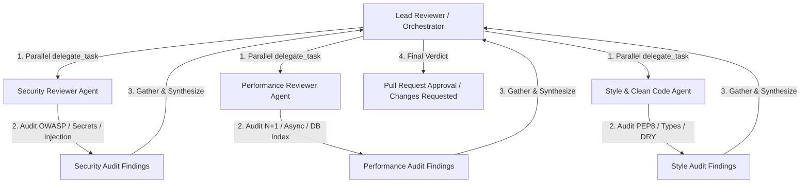

# Parallel Multi-Agent Code Review Workflow (Scatter-Gather Pattern)

This document guides how to organize a parallel Code Review workflow (Parallel Review Workflow) using the `delegate_task` tool in `agy-kit`. The process uses 3 parallel review specialists: **Security Reviewer**, **Performance Reviewer**, and **Style/Clean Code Reviewer**.

---

## 1. Interaction Model (Scatter-Gather Pattern)



- **Reduced processing time (Wall-Clock Time):** Running 3 subagents in parallel reduces review time by 65% compared to sequential execution.
- **Separation of Concerns:** Each subagent focuses 100% on its own domain, avoiding distraction or missed errors.

---

## 2. Parallel `delegate_task` Command Configuration

The Lead Reviewer triggers 3 subagents simultaneously using a JSON payload command:

```json
{
  "tasks": [
    {
      "id": "review-security",
      "agent": "reviewer-security",
      "model": "gemini-3.6-flash-high",
      "prompt": "Audit git diff for security risks: OWASP Top 10, SQL Injection, Argon2/Bcrypt hash strength, Hardcoded Secrets, Rate Limiting. Return JSON report format.",
      "context_files": ["src/auth/auth_service.py", "src/auth/repository.py"]
    },
    {
      "id": "review-performance",
      "agent": "reviewer-performance",
      "model": "gemini-3.6-flash-high",
      "prompt": "Audit git diff for performance: N+1 DB Queries, Missing DB Indexes on email column, Async I/O blocking call (e.g. sync SMTP in async route), Memory Leaks.",
      "context_files": ["src/auth/repository.py", "src/services/email_service.py"]
    },
    {
      "id": "review-style",
      "agent": "reviewer-style",
      "model": "gemini-3.6-flash-high",
      "prompt": "Audit git diff for code quality: PEP 8 compliance, Type Annotations strictness, SOLID/DRY principles, Clear exception handling, Docstrings.",
      "context_files": ["src/auth/auth_controller.py", "src/auth/schemas.py"]
    }
  ]
}
```

---

## 3. Detailed Tasks of the 3 Reviewers

### Reviewer 1: Security Audit (`reviewer-security`)
- **Checklist Audit:**
  - [x] Passwords securely hashed? (Bcrypt / Argon2id with salt).
  - [x] Verification token securely generated using `secrets.token_hex(32)`?
  - [x] Database queries using ORM parameterized format (Preventing SQL Injection)?
  - [x] Secrets / API Keys / Mailer Password not exposed in code or tests?
  - [x] Rate Limiting applied on `/register` API endpoint?

### Reviewer 2: Performance Audit (`reviewer-performance`)
- **Checklist Audit:**
  - [x] Indexed fields `users.email` and `verification_token`?
  - [x] Does email dispatch block the main route? (Must use async task / BackgroundTasks / Celery).
  - [x] Query checking email existence uses `exists()` instead of fetching entire user object into memory?

### Reviewer 3: Style & Clean Code (`reviewer-style`)
- **Checklist Audit:**
  - [x] Compliant with PEP 8 formatting (Ruff formatted)?
  - [x] 100% full type hints on functions and parameters (Mypy strict passed)?
  - [x] Clear separation between Controller (HTTP layer) and Service (Business logic)?
  - [x] Meaningful variable and function names, no ambiguous abbreviations (`usr`, `chk_tok`)?

---

## 4. Synthesized Review Output Template

After receiving data from the 3 subagents, the Lead Reviewer synthesizes the final report:

```markdown
# 🛡️ Consolidated Code Review Report

> **Target PR:** `feat(auth): User Registration with Email Verification`
> **Verdict:** ⚠️ **CHANGES REQUESTED** (1 Security Critical, 1 Performance Warning)

---

## 🟢 1. Security Audit Findings (`reviewer-security`)
- ❌ **CRITICAL [SEC-01]:** `src/services/email_service.py:18` hardcodes sample SMTP password `password123`.
  - *Fix:* Switch to reading environment variable `os.getenv("SMTP_PASSWORD")`.
- ✅ **PASS:** Password hashed with standard Bcrypt cost factor 12.
- ✅ **PASS:** Parameterized queries via SQLAlchemy 2.0.

## 🟡 2. Performance Audit Findings (`reviewer-performance`)
- ⚠️ **WARNING [PERF-01]:** `send_verification_email` function calls Synchronous SMTP in async FastAPI route.
  - *Fix:* Wrap email sending function in `FastAPI.BackgroundTasks` or `aio-smtp`.
- ✅ **PASS:** Added `idx_users_email` in DB migration script.

## 🔵 3. Style & Architecture Findings (`reviewer-style`)
- ✅ **PASS:** Ruff check 0 errors, Mypy strict passed 100%.
- ✅ **PASS:** Standard Layered Architecture separation.

---

### 🚀 Action Items For Coder Agent:
1. Fix hardcoded secret error at `src/services/email_service.py:18`.
2. Wrap email sending into `BackgroundTasks`.
3. Re-run `agy run --agent reviewer` to grant merge approval.
```
