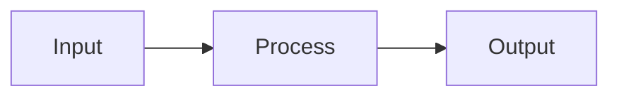

# SPEC: [FEATURE_NAME]

> **Status:** Draft | In Review | Approved  
> **Author:** [Planner Agent]  
> **Date:** YYYY-MM-DD

---

## 1. Executive Summary

### Goals
- [Mục tiêu chính của tính năng]
- [Use-case cụ thể]

### Non-Goals
- [Ranh giới — những gì KHÔNG làm trong phase này]

---

## 2. Architecture & Data Flow



- **Luồng dữ liệu chính:** ...
- **Components liên quan:** ...

---

## 3. Interface & Schema Specification

### API Endpoints (if applicable)

| Method | Path | Request Body | Response | Status Codes |
|--------|------|-------------|----------|-------------|
| POST | `/api/v1/resource` | `{name: string}` | `{id: int, name: string}` | 201, 400, 422 |

### Types / Structs
```typescript
interface Resource {
  id: number;
  name: string;
  createdAt: Date;
}
```

### DB Migration (if applicable)
- Add column `resource.name` to table `resources`.

---

## 4. File Mutation Manifest

| Action | File | Rationale |
|--------|------|-----------|
| Create | `src/resource/controller.ts` | Endpoint handler |
| Modify | `src/routes/index.ts` | Register new route |
| Create | `tests/resource.test.ts` | Unit + integration tests |

> **Ràng buộc:** Agent KHÔNG được sửa file ngoài manifest này.

---

## 5. Test Plan & Edge Cases

### Unit/Integration Tests (Given-When-Then)

| # | Given | When | Then |
|---|-------|------|------|
| 1 | Valid payload | POST /api/v1/resource | HTTP 201, returns resource |
| 2 | Missing name field | POST /api/v1/resource | HTTP 422, error: name required |
| 3 | SQL injection in name | POST /api/v1/resource | HTTP 422, sanitized |
| 4 | Unauthorized (no token) | POST /api/v1/resource | HTTP 401 |

### Boundary Values
- Empty string, null, very long string (10K chars), unicode/emoji.

---

## 6. Backward Compatibility & Migration

- [ ] No breaking changes to existing API?
- [ ] DB migration reversible?
- [ ] Feature flag needed?

---

## 7. Definition of Done

- [ ] All tests pass (coverage ≥ 80%)
- [ ] Lint + typecheck: 0 error, 0 warning
- [ ] No hardcoded secrets (gitleaks clean)
- [ ] OWASP-AI checklist passed
- [ ] Conventional Commits formatted
- [ ] SPEC updated with actual implementation notes
