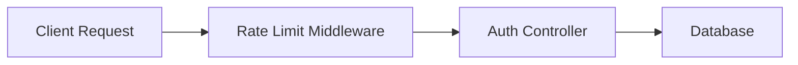

# SPEC: [FEATURE_NAME]

> **Status:** Draft | In Review | Approved  
> **Author:** [Planner Agent]  
> **Date:** YYYY-MM-DD

---

## 1. Executive Summary & Business Analysis

### 1.1 Primary Goals & Non-Goals
- **Goals:** [Primary objective of the feature]
- **Non-Goals:** [Scope boundary — what is explicitly excluded]

### 1.2 Requirement Traceability Matrix (RTM)

| Req ID | Business Requirement Description | Type | Target Component / File | Unit Test Reference | E2E QA Verification | Status |
|--------|----------------------------------|------|-------------------------|---------------------|---------------------|--------|
| REQ-001 | User registration with valid email & password | Explicit | `src/auth/register.ts` | `tests/auth_test.py::test_req_001_register_success` | `tests/qa-evidence/auth/curl_register.log` | Pending |
| REQ-002 | Enforce rate limit (max 5 requests/min per IP) | Implicit | `src/middleware/rate_limit.ts` | `tests/rate_limit_test.py::test_req_002_rate_limit_exceeded` | `tests/qa-evidence/auth/curl_rate_limit.log` | Pending |

### 1.3 Domain Modeling & User Journeys
- **Domain Entities:** User (`id`, `email`, `password_hash`, `status`), Session (`token`, `expires_at`).
- **User Journey:** Actor `[Unauthenticated User]` -> Submit Form -> System Validates Payload -> Hashes Password -> Creates User -> Returns JWT.

---

## 2. Architecture & Data Flow



- **Main Data Flow:** Request enters middleware, passes validation, executes business logic in controller, mutates DB state, returns structured response.
- **Component Dependencies:** Route handler -> Middleware adapter -> Service controller -> DB repository.

---

## 3. Interface & Schema Specification

### API Endpoints

| Method | Path | Request Body | Response Schema | Status Codes |
|--------|------|-------------|-----------------|--------------|
| POST | `/api/v1/auth/register` | `{email: string, pass: string}` | `{user_id: string, token: string}` | 201, 400, 429 |

### Types / Structs
```typescript
interface RegistrationPayload {
  email: string;
  pass: string;
}

interface RegistrationResponse {
  user_id: string;
  token: string;
}
```

---

## 4. File Mutation Manifest

| Action | File Path | Rationale & Responsibility |
|--------|-----------|----------------------------|
| Create | `src/auth/register.ts` | Endpoint handler implementing REQ-001 |
| Modify | `src/routes/index.ts` | Register auth route |
| Create | `tests/auth_test.py` | Unit + integration tests for auth module |

> **Constraint:** Subagents MUST NOT create or modify files outside this manifest.

---

## 5. Test Plan & Edge Case Matrix

### 5.1 Unit / Integration Tests (Given-When-Then)
- **Given** valid registration payload **When** `POST /api/v1/auth/register` **Then** returns HTTP 201 with JWT token.
- **Given** missing email field **When** `POST /api/v1/auth/register` **Then** returns HTTP 400 validation error.

### 5.2 6-Category Edge Case Matrix

| Category | Test Scenario | Input / State Condition | Expected Result & Status Code | Test Case Function |
|----------|---------------|-------------------------|--------------------------------|-------------------|
| Null / Empty | Empty body or missing password | `{email: "user@test.com"}` | HTTP 400 Validation Error | `test_missing_password` |
| Boundary / Limits | Password length 10,000 chars | `{pass: "a"*10000}` | HTTP 400 Payload Too Large | `test_password_too_long` |
| State Mutation | Duplicate email registration | Email already exists in DB | HTTP 409 Conflict | `test_duplicate_email` |
| Auth / Scope Bypass | Invalid / Expired bearer token | Token: `Bearer invalid` | HTTP 401 Unauthorized | `test_invalid_token` |
| Concurrent / Race | Simultaneous register requests | 5 parallel calls with same email | 1 succeeds (201), 4 fail (409) | `test_concurrent_register` |
| Malicious / Injection | SQLi payload in email field | `{email: "' OR 1=1 --"}` | HTTP 400 Sanitized | `test_sqli_sanitization` |

---

## 6. Backward Compatibility & Security Audit

- [ ] OWASP-AI-01 Slopsquatting scanned (no hallucinated packages)
- [ ] OWASP-AI-02 IDOR authorization checks verified
- [ ] OWASP-AI-03 Input sanitization & parameterized queries enforced
- [ ] OWASP-AI-04 Hardcoded secrets scan clean
- [ ] OWASP-AI-05 Excessive agency & path sandboxing verified

---

## 7. Definition of Done & 3-State Verification

- [ ] All RTM requirements mapped 1:1 to passing unit/integration tests
- [ ] 6-Category Edge Case Matrix 100% covered in test suite
- [ ] 3-State Verification audit completed (`Confirmed` state on all claims)
- [ ] `bin/validate-traceability.sh` passed cleanly
- [ ] Conventional Commits recorded
